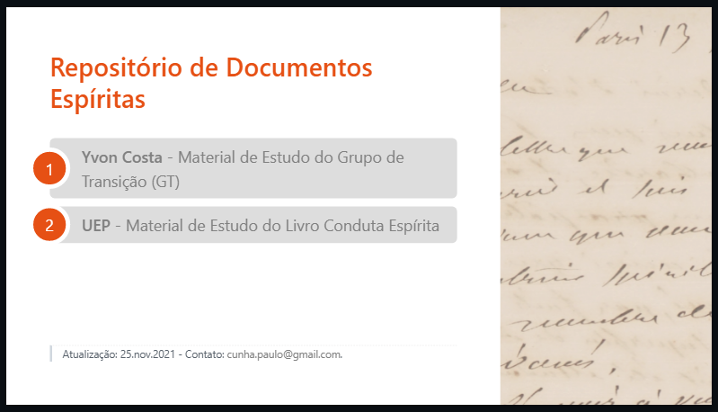

# Welcome to my website at `github.io`.

This website is used temporarely as a repository for my reunion slides.
It has been created using [Marp](https://marpit.marp.app/) as a tool to generate the frontpage.

## About my website

As the need to share some slides with other participants of my study groups grew stronger I decided to endure the effort to learn how to use Github first and then Github.io as a repository of shared projects and a website gently offed for free.

The main website subject is Spiritist Doctrine as codified by Allan Kardec. Fell free and very welcome to take a look inside, althogh it is, for the time beeing, all writen in Portuguese!

As you might suspect the site URL is: [https://cunhapaulo.github.io/](https://cunhapaulo.github.io/).

Cheers!

### Website Front Page:

## About Marp
Marp is a tool created by Yuki Hattori ([@yhatt](https://github.com/yhatt)) to generate beautiful slides from Markdown and CSS code. I strongly urge you to get to know it as a powerful, practical and beautiful generator tool to produce your next world changing slide deck.

- Marp´s website is at: [https://marpit.marp.app/](https://marpit.marp.app/)

Thanks, Yuki Hattori and Marp Team for this marvelous and outstandig tool that Marp is!

## Credits
I owe thanks to [Juan Vera del Campo](http://www.incide.es/en/) (Juanvvc) for some fantastic CSS styles. Thanks!
