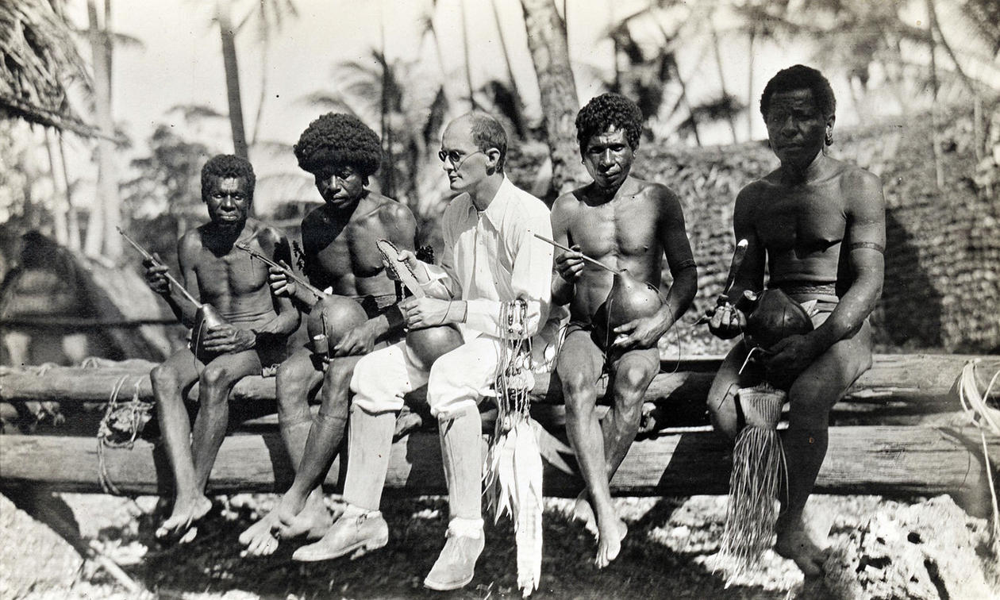

<!-- _class: title-academic -->

Holismo Metodológico nas Ciências Sociais

A abordagem filosófica de Julie Zahle (Bergen University )

Mardonis Silva e Paulo Cunha

08.set.2025

Filosofia da Ciência II   Bacharelado em Filosofia - UFPA

---

# Professora &nbsp;[**Julie Zahle**](https://philpeople.org/profiles/julie-zahle)

- **University of Bergen** 
Department of Philosophy 
Bergen, _Norway_.

- **University of Pittsburgh** 
Department of Philosophy 
PhD, 2009.

- **Areas of Specialization**:  
  - Philosophy of Social Science
  - General Philosophy of Science

---

# Visão Geral do Artigo

- ####  O texto da professora **Julie Zahle**, foi publicado na **Stanford Encyclopedia of Philosophy** e tem o título:
  
  > **"Holismo Metodológico nas Ciências Sociais"**
  
- #### Ele trata de uma **controvérsia metodológica** central quanto ao **nível adequado de explicação** nas _ciências sociais_.

---

# Visão Geral do Artigo

- O artigo problematiza a tensão entre duas formas de explicar **fenômenos sociais**:

  1. `Holismo metodológico:` que defende a **_indispensabilidade_** de explicações baseadas em **_fenômenos sociais_** (instituições, estruturas, cultura etc.);

  2. `Individualismo metodológico:` que sustenta que tais explicações devem derivar _exclusivamente_ dos indivíduos e seus estados intencionais [1].

---

# Distinção entre explicações holistas e individualistas

- `Holistas:` referem-se a fenômenos sociais.

  > **_Exemplos_**: instituições, processos, estatísticas, culturas, normas, papéis sociais, redes etc.

- `Individualistas:` referem-se a indivíduos.

  > **_Exemplos_**:, suas ações, crenças, desejos, intenções etc.

- `Conflito:` holistas consideram mais fenômenos como sociais; individualistas reduzem alguns deles a propriedades individuais (ex.: normas e papéis sociais).

---

<!-- _class: nobrand -->

# Definições e Alcances de **“Fenômenos Sociais”**

O artigo lista uma ampla tipologia de fenômenos sociais considerados válidos para explicações holísticas:

1. **Organizações** (empresas, igrejas);
2. **Processos sociais** (revoluções, crescimento econômico);
3. **Propriedades estatísticas** (taxas de alfabetização ou suicídio);
4. **Culturas e tradições**;
5. **Normas e regras sociais**;

   

6. **Crenças ou desejos atribuíveis a grupos** (e.g., o governo deseja manter o poder);
7. **Propriedades de redes sociais** (densidade, coesão);
8. **Estruturas sociais**;
9.  **Papéis sociais** (motorista, enfermeiro) [1].

   

---

<!-- _class: nobrand -->

# Bronisław Malinowsk

---

<!-- _class: nobrand -->

# Tipos de distinção entre explicações holistas e individualistas

|          Modelo           | Explicações Holistas                                                                                                   | Explicações Individualistas                                                                                    |
| :-----------------------: | ---------------------------------------------------------------------------------------------------------------------- | -------------------------------------------------------------------------------------------------------------- |
|        `Inclusivo`        | **Explanans:** fenômenos sociais; **Explanandum:** pode ser fenômeno   social **ou** individual (ações, crenças) | **Explanans:** indivíduos, ações, crenças, etc. **Explanandum:** pode ser fenômeno social **ou** individual |
|     **Intermediário**     | **Explanans:** fenômenos sociais; **Explanandum:** fenômenos sociais.                                               | **Explanans:** indivíduos, ações, crenças, etc. **Explanandum:** fenômenos sociais                          |
| **Simétrico Restrito** | **Explanans:** fenômenos sociais; **Explanandum:** fenômenos sociais.                                               | **Explanans:** indivíduos, ações, crenças, etc. **Explanandum:** indivíduos, ações, crenças, etc.           |

 

>  - **_Explanans_**: aquilo necessário para explicar (premissas, causas, eventos antecedentes ou leis científicas).
>  - **_Explanandum_**: o que precisa ser explicado. Problema ou a questão que precisa de resposta.

---

# Primeiro debate – **Indispensabilidade**

- **Holistas:** defendem que explicações baseadas em instituições, estruturas sociais ou culturas são `indispensáveis`.

  > **_Exemplos_**: “os sindicatos protestaram porque o governo queria reduzir o salário mínimo”; “o aumento do desemprego levou a maior criminalidade”.

- **Individualistas** defendem que apenas explicações baseadas em indivíduos, suas ações e crenças devem ser usadas.

---

# Segundo debate – **Microfundamentos**

- **Holistas** afirmam que algumas explicações puramente sociais podem se sustentar sem recorrer a explicações em nível individual.

  > ***Exemplo***: “a depressão econômica foi a principal razão para a eclosão da guerra”.

- **Individualistas** exigem sempre que `microfundamentos individuais` estejam presentes para tais explicações.

---

# Terminologia

- #### Dentro das ciências sociais, raramente se usa o termo **“holismo metodológico”** de forma explícita; aparecem rótulos como **“coletivismo”** ou **“holismo explicativo”**.

- #### Independentemente da **nomenclatura**, o termo abrange tanto a `indispensabilidade` das explicações **holistas** quanto a tese de que **não** precisam sempre de `microfundamentos`.

---

# Outros debates individualismo-holismo

- ### **Ontológico**: se os fenômenos sociais existem _sui generis_.

- ### **Confirmação**: se explicações sociais precisam sempre ser confirmadas no nível individual.

- ### **Moral**: se entidades sociais podem ter responsabilidade moral.

* #### É possível defender o holismo metodológico sem assumir as teses holistas nos demais âmbitos (ontologia, confirmação, moralidade).

---

<!-- _class: chapter -->

# O Debate sobre a Dispensabilidade

---

# Fases do Debate

- `Emile Durkheim` defendeu a indispensabilidade das explicações holistas em vários escritos. Ele afirmou a famosa frase de que:

   "[...] a <b>causa determinante</b> de um fato social deve   ser buscada entre os <b>fatos sociais que o precedem</b>   e não entre os <b>estados da consciência individual</b>."   <small>(Durkheim, 1938)</small>.

- `Max Weber` é o principal defensor do individualismo metodológico no mesmo período.

---

# Fases do Debate

- `Primeira fase moderna (1950s):` Hayek, Popper e Watkins defendem o **individualismo**; Gellner, Goldstein e Mandelbaum respondem sustentando o holismo;

- `Segunda fase (anos 1980 até hoje):` novos argumentos **pró-holismo** (Bhaskar, Garfinkel, Kincaid, Jackson & Pettit).

---

# Três posições básicas

- `Holismo forte:` apenas explicações holistas devem ser aceitas; explicações individualistas devem ser descartadas **(quase sem defensores atuais)**.

- `Holismo moderado:` tanto explicações holistas quanto individualistas são indispensáveis; cada qual útil em contextos diferentes **(posição predominante entre holistas)**.

- `Individualismo metodológico:` apenas explicações individualistas são indispensáveis; explicações holistas devem ser descartadas.

---

# Ponto central da disputa

- O `debate atual` concentra-se entre **holismo moderado** e **individualismo**.

- Ambos concordam que **explicações individualistas são necessárias**; a questão é **se explicações holistas também o são**.

---

<!-- _class: chapter -->

# Por que alguns argumentos
## propõem de que explicações holistas são indispensáveis nas ciências sociais?

---

<!-- _class: blank -->

### <!-- fit --> Argumentos para a   indispensabilidade  das **explicações holistas**

---
# PrincipaisArgumentos

<!-- _class: nobrand -->
<!-- _backgroundColor: lightgray -->

|                        Argumento                        | Estrutura básica                                                                                                           | Ideia central                                                                                                                                                    |
| :-----------------------------------------------------: | -------------------------------------------------------------------------------------------------------------------------- | ---------------------------------------------------------------------------------------------------------------------------------------------------------------- |
|     2.1   **Dos fenômenos sociais como causas**      | Se fenômenos sociais possuem eficácia causal, explicações holistas são indispensáveis.                                     | Fenômenos sociais possuem propriedades causais próprias, não redutíveis a indivíduos.                                                                            |
|       2.2   **Da impossibilidade de tradução**       | Explicações holistas não podem ser traduzidas em termos puramente individualistas.                                         | Conceitos sociais não são redutíveis a conceitos psicológicos/individuais.                                                                                       |
| 2.3   **Da impossibilidade de redução interteórica** | Se teorias sociais não podem ser reduzidas a teorias individualistas, explicações holistas são indispensáveis.             | Predicados sociais (ex.: _“igreja”_, _“revolução”_) são múltiplamente realizáveis, inviabilizando redução.                                                       |
|          2.4   **Do regresso explicativo**           | Se sempre preferirmos explicações de menor escala, caímos em regresso infinito (indivíduo → biologia → química → física…). | Para evitar regressão, não se pode descartar   explicações holistas apenas por não focarem nos indivíduos.                                                    |
|   2.5   **Dos interesses explicativos distintos**    | Algumas perguntas (_**“why-questions”**_) só podem ser respondidas por explicações holistas.                               | Explicações holistas fornecem informação modal comparativa (o que ocorreria em outros mundos   possíveis), distinta da informação contrastiva individualista. |
|        2.6   **Das preocupações pragmáticas**        | A escolha entre explicações deve considerar custos e eficácia pragmática.                                                  | Às vezes é mais barato, rápido e didático usar explicações holistas.                                                                                             |

---

<!-- _class: chapter -->

# Por que explicações puramente 
## holísticas podem, às vezes, se sustentar por si mesmas?

---

# Explicações puramente holísticas **possíveis**?

-  Seria possível que explicações expressas **puramente em nível social**, sem recorrer a **mecanismos individuais**, sejam aceitáveis. 
    > ***Exemplo***: “A depressão econômica foi a principal razão pela qual a guerra eclodiu.” 

- Os **holistas metodológicos** afirmam que tais explicações possuem **autossuficiência legítima**; 
- Os **individualistas** argumentam que **sempre** é necessário fundamentá-las em comportamentos ou intenções individuais.

---

# Argumentos **explicações puramente holísitcas**

|                    Argumento                    | Tese central                                                                                                                                 | Estrutura/Ideia principal                                                                                                                                                      |
| :---------------------------------------------: | -------------------------------------------------------------------------------------------------------------------------------------------- | ------------------------------------------------------------------------------------------------------------------------------------------------------------------------------ |
| 4.1   **Dos mecanismos sociais subjacentes** | Explicações holistas podem ser complementadas por mecanismos de nível social inferior, não necessariamente por microfundamentos individuais. | Fenômenos sociais têm diferentes níveis de organização (nação > empresa > escola). Explicações podem recorrer a mecanismos de nível social mais baixo, permanecendo holistas.  |
|     4.2   **Do regresso de mecanismos**      | O modelo mecanicista gera um regresso infinito e, por isso, deve ser rejeitado.                                                              | Se toda explicação exige mecanismos subjacentes, sempre seria preciso recuar até mecanismos físicos básicos → exigência impossível.                                            |
|     4.3   **Das práticas explicativas**      | Nossas práticas comuns aceitam explicações sem mecanismos detalhados.                                                                        | Explicações cotidianas e científicas são consideradas válidas mesmo sem descrição completa dos mecanismos.                                                                     |
| 4.4   **Das considerações não-mecanicistas** | Modelos alternativos de explicação mostram que explicações puramente holistas podem ser completas.                                           | a) Modelo erotético (resposta a porquês contrastivos). b) Explicações mais gerais podem ser preferíveis às que detalham mecanismos individuais (aplicabilidade mais ampla). |

---

  

# Referências

1. Zahle, J. **Methodological Holism in the Social Sciences**, _Stanford Encyclopedia of Philosophy_, atualização em 23 de outubro de 2023. Disponível em: [Enciclopédia de Filosofia de Stanford](https://plato.stanford.edu/entries/holism-social).
2. Heath, J. **Methodological Individualism**, _Stanford Encyclopedia of Philosophy_, revisão em 12 de junho de 2024. Disponível em: [Enciclopédia de Filosofia de Stanford](ttps://plato.stanford.edu/entries/methodological-individualism).
3. Durkheim, E. **The Rules of Sociological Method**. New York: The Free Press, 1938 [1895].
4. Durkheim, E. **Suicide**, New York: Free Press of Glencoe, 1951 [1897].

---

<!-- _class: blank -->

### <!-- fit --> Pela atenção,  obrigado!

