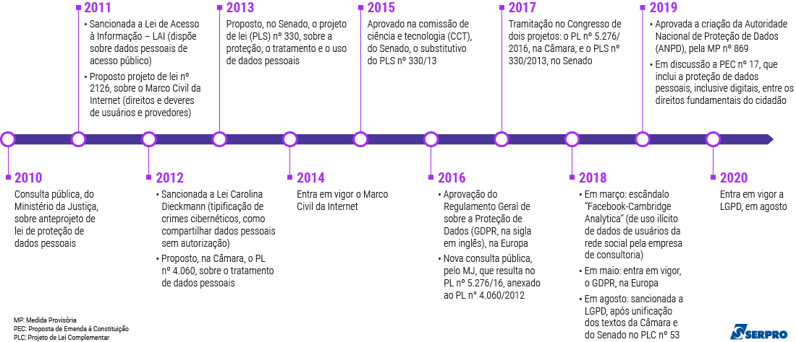

<!-- 
---- [ ] ------------------- [ SLIDE ] --------------------- [ ] ----

-->

  
<!-- _class: titlepage -->
<!-- _backgroundColor: #000028 -->

 A Proteção de <strong>Dados Pessoais</strong> e o Papel do Poder Judiciário na Sociedade da Informação

 Uma abordagem introdutória                             

 Tribunal de Justiça do Estado do Pará                  

 09 a 13 de maio de 2022                                

 Escola Judicial do Poder Judiciário do Estado do Pará  

---

<!-- 
---- [ ] ----------------------- [ SLIDE ] ------------------------- [ ] ----
-->

<!-- footer: Todos os direitos reservados - Paulo Cunha.-->

  

  

  

  

  ## **Paulo Roberto Martins Cunha**
  - Engenheiro Eletricista - UFPA (1992);
  - Bacharel em Direito - UFPA (2020);
  - Analista Judiciário - TJPA (1995);

  #### Interesses:
  - Aspectos Jurídicos sobre Privacidade, Segurança da Informação, Direito Digital.
    
  #### Contatos:
  - e-mail: paulo.cunha@tjpa.jus.br;
  - tel.: (91) 98111-5890 (WhatsApp).

      

---

<!-- 
---- [ ] ----------------------- [ SLIDE ] ------------------------- [ ] ----

-->
<!-- 

-->
<!-- _class: titlepage -->
<!--
# A Proteção de **Dados Pessoais** e o Papel do Poder Judiciário na  Sociedade da Informação
## Uma abordagem introdutória             
### Tribunal de Justiça do Estado do Pará 
#### 09 a 13 de maio de 2022                           
##### Escola Judicial do Poder Judiciário do Estado do Pará 

---

---
-->

<!-- 
---- [ ] ----------------------- [ SLIDE ] ------------------------- [ ] ----
-->
<!-- _class: transition2 -->

Conteúdo Programático 

---
<!-- 
---- [ ] ----------------------- [ SLIDE ] ------------------------- [ ] ----
-->

# Conteúdo Programático: 

1. **Rretrospecto**    (_Paulo Cunha_)

1. **Ordenamento Jurídico Brasileiro: Do Sistema de Proteção ao Consumidor à LGPD**    (_Monique Leite_)

1. **Conceitos, Princípios e Hipóteses de Tratamento de Dados Pessoais**    (_Paulo Cunha_)
1. **Ciclo de Vida dos Dados**    (_Monique Leite_)

---

<!-- 
---- [ ] ----------------------- [ SLIDE ] ------------------------- [ ] ----
-->
# Pontos importantes

* **Ilimitação** no uso dos dados pessoais;

* **Propriedade** (patrimônio) das informações pessoais;
* **Consentimento**:  manifestação consciente da vontade;
* Menosprezo ou desprezo pela **dimensão privada** individual;
* Autodeterminação e direito individual ao **anonimato**;

* **Vigilância** estatal e particular sobre o indivíduo;

* **Apropriação** (indébita) dos dados pessoais;
* **Derivação** de informações potencialmente danosas;
* Atividades legais do **Estado** (segurança, justiça, etc.)
* Desenvolvimento **econômico** vs. Garantia de **direitos individuais**;

---
<!-- 
---- [ ] ----------------------- [ SLIDE ] ------------------------- [ ] ----
-->
<!-- _class: transition2 -->
Retrospecto

_Histórico, Literario,  Sociológico, Político_

(Paulo)

---
<!-- 
---- [ ] ----------------------- [ SLIDE ] ------------------------- [ ] ----

O que é a verdade?

---
-->

<!-- 
---- [ ] ----------------------- [ SLIDE ] ------------------------- [ ] ----

- Toda a discussão articulada no curso, só faz sentido pela
  posição de protagonismo que a internet e os dados (especialmente os dados pessoais)
  passaram a ter nos últimos 30 anos;

- Alguns fatores influenciam diretamente:
  - O surgimento da internet como via de interligação realmente global
  - O surgimento de dispositivos computacionais móveis com conecão rápida à Internet
  - Crescimento exponencial dos hábitos e do uso intensivo de serviços on-line (vendas, aplicativos, redes sociais, etc...)  
  - Surgimento de algoritmos capazes de reproduzir capacidades e juízos humanos (perícia em análises médicas, diagnósticos, resolução de problemas, reconhecimento de padrões e comportamentos)

- Todas as ações que desenvolvemos na Internet deixam registros na forma de 
  rastro digitais: 
  - Acessos a site,
  - Pesquisas nos mecanismos de busca (Google),
  - Filições nas redes sociais,
  - Curtidas, likes, corações, manifestações de apoio ou de reprovação, conteúdo de mensagens.
  - Compras realizadas (Amazon, Americanas, Magalu, iFood, Burgerking, etc...), 
  - Serviços "grátis" (Google Apps, Gmail, Yahoo, Facebook, Twitter, )
  - Locais por onde transitamos,quando e onde estamos. 

- Todos esses rastros são insumos para monetização das vendas das empresas
  - Propaganda comercial ou em defesa de interesses (políticos)
  - Sugestão de produtos
  - definição de respostas nos mecanismos de busca (delimitação da realidade)
    
- Poderes e potências, antes situados apenas na esfera política do Estado, estão hoje sob poder particular. 

- Empresas como Google, Facebook e outras tem poder de determinar
  o que é ou não possível discutir no novo espaço público;
  -  Fake News, fact-checks

- Capital e trabalho estão sendo afetados diretamente por essa mudança

- Os algorítmos que hoje mineram dados tendem a determinar comportamentos 
  e valores para as próximas gerações.  

- A forma de pensar e valores morais humanos sendo 

- Digital Roads to Totalitarianism: Markets of Attention, Misinformation 
  and Manipulation
-->

<!-- _class: transition -->

_Sociedade da Informação_

---
<!-- 
---- [ ] ----------------------- [ SLIDE ] ------------------------- [ ] ----
-->

### Dados na Internet  em **1 minuto** (2019):

- **3.8 milhões** de consultas no **Google**
- **87.5 mil** tweets no **Twitter**
- **347 mil** acessos no **Instagram**
- **1 milhão** de logins no **Facebook**
- **41.6 milhões** mensagens no **WhatsApp**
- **4.5 milhões** de videos no **YouTube**
- **Netflix** transmite **695 mil** horas/videos 
- **996 mil** dólares em compras online

> Fonte: [Site Visual Capitalist](https://www.visualcapitalist.com/what-happens-in-an-internet-minute-in-2019/)

---
<!-- 
---- [ ] ----------------------- [ SLIDE ] ------------------------- [ ] ----
-->

### Dados na Internet  em **1 minuto** (2021):

- **Google**: **5.7 milhões** (66,5% aumento)
- **575 mil** tweets no **Twitter**
- **65 mil** fotos postadas no **Instagram**
- **240 mil** fotos postadas no **Facebook**
- **Facebook** recebe  **44 milhões** de views
- **YouTube** recebe **694 mil** horas/videos 
- **Netflix** transmite **453 mil** horas/videos 
- **167 milhões** de vizualizações no **Tiktok**
- **6 milhões** de pessoas compram online

> Fonte: [What Happens in an Internet Minute In 2021?](https://www.visualcapitalist.com/from-amazon-to-zoom-what-happens-in-an-internet-minute-in-2021/)
---

<!-- 
---- [ ] ----------------------- [ SLIDE ] ------------------------- [ ] ----
-->

# Como as **BigTechs** faturam seus Bilhões?

- Em **2021**, as **Big Five** da área de technologia geraram em vendas, sozinhas, mais de _US$ 1.4 trilhão_

- Esse valor total é aproximadamente igual ao PIB do Brasil e maior que o PIB do México, da Indonésia e da Espanha!

 

> Fonte: [Site Visual Capitalist](https://www.visualcapitalist.com/how-big-tech-makes-their-billions-2022/)

---
<!-- 
---- [ ] ----------------------- [ SLIDE ] ------------------------- [ ] ----

Atenção para os valores com ADVERTISING (Propaganda)
-->

# Receita com Propaganda

> Fonte: [Site Visual Capitalist](https://www.visualcapitalist.com/how-big-tech-makes-their-billions-2022/)

---
<!-- 
---- [ ] ----------------------- [ SLIDE ] ------------------------- [ ] ----
-->

## Projeção de Crecimento   2016 $\rightarrow$ 2025

---
<!-- 
---- [ ] ----------------------- [ SLIDE ] ------------------------- [ ] ----
-->

<!-- _class: transition -->

_Você sabe o que sabem sobre você?_

---
<!-- 
---- [ ] ----------------------- [ SLIDE ] ------------------------- [ ] ----
-->

# O que sabem sobre você?

* Já se perguntou **quem** sabe o **quê** sobre você (na Internet)?
  
* O que seu **celular**/computador **revela** sobre você, sem que saiba?
* Seus **likes**, suas **pesquisas** no Google, **postagens** que você faz? 

* **Quem**, além de você, regitra sua movimentação?
* **Onde** esse seus dados ficam armazenados?
* O que é **feito** com todos esses registros?
* Qual a **legalidade** de tudo isso que acontece na Internet?

---
<!-- 
---- [ ] ----------------------- [ SLIDE ] ------------------------- [ ] ----
-->

<!-- _class: transition -->

_Sua Localização_

---
<!-- 
---- [ ] ----------------------- [ SLIDE ] ------------------------- [ ] ----
-->

## **Localização**

* Quem mais conhece seu itinerário diário?

* Em que momento você esteve em determinado lugar?
* Quais suas origens e destinos nos trechos das viagens?
* Qual a duração do percurso inteiro?
* O que pode ser feito com essas informações???

---
<!-- 
---- [ ] ----------------------- [ SLIDE ] ------------------------- [ ] ----
-->

<!-- _class: transition -->

_Seus Hábitos de Consumo_

---

<!-- 
---- [ ] ----------------------- [ SLIDE ] ------------------------- [ ] ----
-->

## **Hábitos de Compras**

- Quem sabe o que você compra?

- Suas preferências?
- Quanto gasta?
- Quanto tempo passar escolhendo?
- Quais livros você lê?
* Quem sabe seus números de cartão?

---

<!-- 
---- [ ] ----------------------- [ SLIDE ] ------------------------- [ ] ----

-->

## **Hábitos Alimentares**

- Quem sabe o que você compra?

- Suas preferências?
- Quanto gasta?
- Quanto tempo passa escolhendo?
* Quem sabe seus números de cartão?

---

<!-- 
---- [ ] ----------------------- [ SLIDE ] ------------------------- [ ] ----

-->

## **Hábitos Financeiros**

- Quem sabe das suas movimentações bancárias?

- Quem tem acesso ao seu histórico de crédito?
- Quanto gasta e quanto deve?
- Em quais bancos tem conta?
* Quem sabe seus números de cartão?

---

<!-- 
---- [ ] ----------------------- [ SLIDE ] ------------------------- [ ] ----

-->

<!-- _class: transition -->

_Seus Registros de Saúde_

---

<!-- 
---- [ ] ----------------------- [ SLIDE ] ------------------------- [ ] ----

SAÚDE:

Os dados podem AJUDAR:
- diagnósticos mais precisos (Inteligência Artificial)
- Correlações feitas por máquina para diagnóstico
- Estatísticas para saúde pública e melhores políticas de saúde
- Prognóstico antecipado de doenças e tratamento mais eficaz
- Redução nos gastos públicos com saúde

Os dados podem PREJUDICAR:
- Correlação de pessoas com doenças genéticas
- Desvantagens trabalhistas
- Seleção discriminatória para trabalho (não chama, ou demite, os possíveis doentes)
- Eugenia por seleção social (eutanásia)
  
-->

## **Registros de Saúde**

- Quem sabe quanto você gasta com saúde?
  
- Quais doenças você tem ou já teve?
- Quais as suas predisposições genéticas?
- Quem sabe se você teve COVID-19 ou não?

* Quem são seus parentes?
* Quem pode saber como você será aos 65 anos?

---

<!-- 
---- [ ] ----------------------- [ SLIDE ] ------------------------- [ ] ----

-->

 **Diagnóstico Preditivo de Mal de Parkinson**
## Reportagem de 2019 da Deutsche Welle (**DW**) sobre Inteligência Artifical e Algoritmmos, com o Dr. Max Little (Birminghan,UK). 

Video disponível no [Youtube](https://www.youtube.com/watch?v=s0dMTAQM4cw&t=572s).

---

<!-- 
---- [ ] ----------------------- [ SLIDE ] ------------------------- [ ] ----
-->

---
<!-- 
---- [ ] ----------------------- [ SLIDE ] ------------------------- [ ] ----

-->

## Dados Coletados de Celular

- O **acelerômetro** dos **celulares** permite **registrar** e **armazenar** dados sobre a forma de **caminhar** do usuário(a).
 
- Pelo **tratamento** desses dado, pequenas alterações no movimento do andar são usados em **modelos matemáticos** capazes de predizer um diagnóstico de mal de Parkinson.

---

<!-- 
---- [ ] ----------------------- [ SLIDE ] ------------------------- [ ] ----

ACELERÔMETRO: Um acelerômetro é um dispositivo eletromecânico que mede as forças de aceleração. Estas forças podem ser estáticas, como força da gravidade ou dinâmicas, causadas pela movimentação ou vibração do acelerômetro.
-->

# Acelerômetro

---

<!-- 
---- [ ] ----------------------- [ SLIDE ] ------------------------- [ ] ----
-->

---
<!-- 
---- [ ] ----------------------- [ SLIDE ] ------------------------- [ ] ----
-->

---

<!-- 
---- [ ] ----------------------- [ SLIDE ] ------------------------- [ ] ----
-->

---
<!-- 
---- [ ] ----------------------- [ SLIDE ] ------------------------- [ ] ----

Esses dados podem ser coletados de quase todos os celulares atuais
O que se pode fazer com esses diagnósticos preditivos?

- Atuar proativamente no tratamento.
- Fazer uma lista de funcionários que tenham esse diagnóstico.
- Reprovar candidatos a vagas de emprego com base no seu perfil de patologias.
  
QUE OUTROS DADOS ESTÃO SENDO COLETADOS E PARA QUE SERVIRÃO?
Para o BEM e para o MAL.  
-->

---
<!-- 
---- [ ] ----------------------- [ SLIDE ] ------------------------- [ ] ----

Esses dados podem ser coletados de quase todos os celulares atuais
O que se pode fazer com esses diagnósticos preditivos?

- Atuar proativamente no tratamento.
- Fazer uma lista de funcionários que tenham esse diagnóstico.
- Reprovar candidatos a vagas de emprego com base no seu perfil de patologias.
  
QUE OUTROS DADOS ESTÃO SENDO COLETADOS E PARA QUE SERVIRÃO?
Para o BEM e para o MAL.  
-->

QUE OUTROS **SINAIS BIOFÍSICOS** PODEM OU ESTÃO SENDO COLETADOS NESTE MOMENTO?

* Voz
* Pressão arterial
* Frequência cardíacos
* Temperatura corporal
* Fisiognomia
* Impressões digitais
* Movimento ocular
* Frequência respiratória

QUE TIPO DE **CORRELAÇÕES** E **INFERÊNCIAS** PODEM SER FEITAS COM ESSES DADOS?

- Patologias psicobiofísicas
- Perfil psicológico
- Humor
- Orientação sexual
- Orientação política
- Hábitos pessoais privados
- Níveis de anciedade
- Condições físicopsicológicas especiais

---

### Notícia do dia **03 de maio de 2022**:

/i.s3.glbimg.com/v1/AUTH_da025474c0c44edd99332dddb09cabe8/internal_photos/bs/2022/v/W/A4cKDKQHye3oDjMmsx2Q/aplicativo-celular-detectar-tdah-alzheimer.png)

---
<!-- 
---- [ ] ----------------------- [ SLIDE ] ------------------------- [ ] ----
-->

<!-- _class: transition -->

_Seus Hábitos de Uso da Internet_

---

---

<!-- 
---- [ ] ----------------------- [ SLIDE ] ------------------------- [ ] ----
-->
<!-- _class: transition -->

_Vigilância Estatal_

---
<!-- 
---- [ ] ----------------------- [ SLIDE ] ------------------------- [ ] ----

GEORGE ORWELL:

    Nome: Eric Arthur Blair (1903 - 1950)
    Sinopse: Escritor, jornalista e ensaísta político inglês.

    Animal Farm (1945):

    O adjetivo "orwelliano" conota uma atitude e uma política de controle pela propaganda, vigilância, desinformação, negação da verdade e manipulação do passado. 
    
    1984 (1949):

    Em Mil novecentos e oitenta e quatro, Orwell descreveu um governo totalitário que controlava o pensamento controlando a linguagem, tornando certas idéias literalmente impensáveis. 
    Várias palavras e frases de Mil novecentos e oitenta e quatro entraram na linguagem popular de lingua inglesa. "Novilíngua" é uma linguagem simplificada e ofuscante projetada para tornar o pensamento independente impossível. "Duplipensar" significa sustentar duas crenças contraditórias simultaneamente. A "Polícia do Pensamento" é aquela que suprime todas as opiniões divergentes. "Prolefeed" é homogeneizada, fabricada literatura superficial, filme e música usados ​​para controlar e doutrinar a população através da docilidade. "Big Brother" é um ditador supremo que observa a todos.

-->

# George Orwell: 1984

- A **Literatura** e o **Cinema** como registros culturais e sociológicos contemporâneos.
- O **Estado** e a **vigilância** do cidadão.
- **Direito** a ter direitos;
- A **Privacidade** como direito individual.

---
<!-- 
---- [ ] ----------------------- [ SLIDE ] ------------------------- [ ] ----

- Publicado em 8 de junho de 1949, o romance distópico é considerado uma das obras mais importantes da língua inglesa. 

- Na história, um homem com uma vida aparentemente insignificante recebe a tarefa de falsificar documentos públicos para perpetuar a propaganda de um governo autoritário que tem como objetivo parecer sempre correto no que faz.

- O mundo descrito por Orwell é o de 1) uma GUERRA PERPÉTUA, acompanhada pela 2) VIGILÂNCIA GOVERNAMENTAL e a 3) MANIPULAÇÃO PÚBLICA — universo concebido com o objetivo de mostrar os perigos do TOTALITARISMO que, se não combatido, pode triunfar em qualquer lugar. 

- Nos anos recentes, porém, as descrições de Orwell passaram a se parecer cada vez mais com a realidade. Ou, poderíamos dixzer que a realidade se aproximou da descrição distópica de Orwell.

-->
<!-- _class: transition -->

_Big Brother is Watching You!_

---
<!-- 
---- [ ] ----------------------- [ SLIDE ] ------------------------- [ ] ----
Conceitos:

GRANDE IRMÃO:
Na sociedade de 1984, todos estão sob vigilância do governo por teletelas bidirecionais que funcionam tanto como televisores quanto câmeras que filmam quem está na frente delas. Hoje, pode ser comparado às redes sociais, com as quais voluntariamente compartilhamos nossas informações, mas também coletam e processam nossos dados sem que estejamos totalmente cientes. Se alguma vez você já sentiu que o Instagram, Facebook ou outro aplicativo “leram” a sua mente (quem nunca sentiu vontade de comer pizza e, de repente, viu surgirem anúncios de delivery de pizza em suas redes?), a culpa é do “Big Brother”.

2+2=5:
É o conceito segundo o qual o controle sobre a realidade física não importa, desde que as percepções sejam controladas para se adequarem ao desejo das autoridades. É como se a mentira passasse a ser considerada verdade ao se tornar uma crença coletiva, como o resultado da conta 2+2 que, mesmo matematicamente conhecido e justificado como 4, é derrubado em favor de outro resultado mais conveniente. A lógica hoje se aplica às fake news: a informação em si deixa de ser importante e o que passa a valer é a fonte de onde ela veio — “se fulano disse, é porque verdade” ou “ se está na internet, é porque é verdade”.

DUPLIPENSAR:
O 2+2=5 só é possível graças a um fenômeno mais profundo, chamado por Orwell de “duplipensar”. Trata-se de aceitar duas crenças contraditórias ao mesmo tempo, mas sem noção de que se trata de uma contradição — é isso que difere o duplipensar da hipocrisia ou da neutralidade. “É o poder de manter duas crenças contraditórias na mente ao mesmo tempo, de contar mentiras deliberadas e ao mesmo tempo acreditar genuinamente nelas, e esquecer qualquer fato que tenha se tornado inconveniente”, descreve Orwell. No mundo atual, seriam os “fatos alternativos”, como a “tese” de que o nazismo era de esquerda ou, na atual conjuntura de pandemia de Covid-19, de que a doença não passa de “uma gripezinha”, mas usar máscaras e fazer manifestações de dentro do carro para se proteger.

BURACO DA MEMÓRIA:
No livro, seria qualquer mecanismo usado para alterar ou destruir documentos, fotos, gravações e textos considerados inapropriados na tentativa de dar a impressão de que algo nunca aconteceu. Quase como um tipo ainda mais grave de censura, pois tem como objetivo reescrever a história para que se torne conveniente. Pode ser comparado à declaração do Ministério da Saúde do governo de Jair Bolsonaro, que afirmou que pretende recontar os mortos pela Covid-19 por considerar os dados “fantasiosos” ou a tentativa de considerar a causa da morte “parada cardíaca”, e não Covid-19, para mascarar os dados (quando, na prática, a parada total do coração é sempre a causa literal da morte de uma pessoa, o que provocou a parada é que deve ser levado em consideração).
-->

<!-- _class: transition -->

"Quem Controla o Passado, controla o futuro. Quem controla o presente,  controla o passado."   **George Orwell** 

---
<!-- 
---- [ ] ----------------------- [ SLIDE ] ------------------------- [ ] ----
-->

# Estados Totalitários

* Vigilância e monitoramento

* Nazismo x Gestapo

* Alemanha Oriental x STASI

---
<!-- 
---- [ ] ----------------------- [ SLIDE ] ------------------------- [ ] ----
-->

# Controle Social 

* Vigilância e Monitoramento eletrônica

* China: Reforço comportamental pela bonificação social

* EUA: Monitoramento radical da internet (Snowden)

---
<!-- 
---- [ ] ----------------------- [ SLIDE ] ------------------------- [ ] ----
-->

# China - Sistema de Vigilância em Massa 
[Sistemas de reconhecimento facial](https://www.tecmundo.com.br/seguranca/229619-china-desenvolve-novo-sistema-vigilancia-massa.htm) são peças fundamentais para segurança realizada pelo governo da China.

> Fonte: [Tecmundo (2020).](https://www.tecmundo.com.br/software/151179-reconhecimento-facial-china-preparado-covid-19.htm)

---
<!-- 
---- [ ] ----------------------- [ SLIDE ] ------------------------- [ ] ----
-->

---
<!-- 
---- [ ] ----------------------- [ SLIDE ] ------------------------- [ ] ----
-->

# Óculos de reconhecimento facial para policiais

> Fonte: [BBC News (2018).](https://www.bbc.com/news/world-asia-china-42973456)

- O governo da China vem construindo o que ele chama de "a maior **rede de vigilância** de câmeras do mundo".   

- Em todo o país, **170 milhões** de câmeras de CFTV já estão instaladas e estima-se que **400 milhões** de novas serão instaladas nos próximos três anos.

---

---
<!-- 
---- [ ] ----------------------- [ SLIDE ] ------------------------- [ ] ----
-->

# Objetivo: identificação de suspeitos

- Os óculos se conectam a banco de dados de suspeitos. Permite aos policiais varrer multidões enquanto procuram por fugitivos. 

- Os óculos já ajudaram na capturar sete suspeitos. Os crimes que vão desde atropelamentos e fuga até tráfico humano.

- Os críticos temem que a tecnologia confira ainda mais poder ao governo.

> Fonte: [BBC News (2018).](https://www.bbc.com/news/world-asia-china-42973456)

---
<!-- 
---- [ ] ----------------------- [ SLIDE ] ------------------------- [ ] ----
-->
<!-- _class: transition -->

Edward Snowden:

 _Vigilância Estatal_

---
<!-- 
---- [ ] ----------------------- [ SLIDE ] ------------------------- [ ] ----
-->

# O legado duradouro do 11 de setembro de 2021

- **11.set.2021**: Ataque às torres gêmeas no coração de Manhanttan.
  
- **26.out.2021**: edição do "Patriot Act" pelo então presidente George W. Bush.

---

  - ### Poderes ilimitados para interceptação de comunicações em busca de atividade terrorista;
  
  - ### Permissão para ação militar preventiva fora dos limites territoriais dos EUA, contra futuros ataques terroristas.

> Título original: The Uniting and Strengthening America by Providing Appropriate Tools Required to Intercept and Obstruct Terrorism Act.     
> [Link para o documento.](https://www.justice.gov/archive/ll/what_is_the_patriot_act.pdf)
---
<!-- 
---- [ ] ----------------------- [ SLIDE ] ------------------------- [ ] ----
-->

---
<!-- 
---- [ ] ----------------------- [ SLIDE ] ------------------------- [ ] ----
QUESTIONAMENTO: 
- Onde são os espaços públicos de discussão hoje?
- As midias sociais assumiram esse papel.
- Quais as implicações de serem particulears?
-->

<!-- _class: transition -->

Os Espaços Públicos de Discussão   são mesmo Públicos?

 _Vigilância Privada_

---
<!-- 
---- [ ] ----------------------- [ SLIDE ] ------------------------- [ ] ----
-->

# Midias Sociais

### Facebook, Twitter, Instagran, WhatsApp são os novos espaços de debate.

### Espaços de debate públicos como propriedade de particulares, é bom?

---

<!-- 
---- [ ] ----------------------- [ SLIDE ] ------------------------- [ ] ----
-->
<!-- _class: transition -->

O Caso Cambridge Analytica

 _Vigilância Privada_

---
<!-- 
---- [ ] ----------------------- [ SLIDE ] ------------------------- [ ] ----
-->

## A campanha de **Barak Obama** para a Presidências dos EUA foi a primeira grande **experiência** de uso da **Internet** como veículo de **propaganda**.

---
<!-- 
---- [ ] ----------------------- [ SLIDE ] ------------------------- [ ] ----
-->

## Em um **plebiscito**, realizado em 23 de junho de **2016**, eleitores britânicos puderam decidir se o Reino Unido deveria permanecer ou deixar a UE. A maioria — **52%** contra **48%** — decidiu que o país deveria **deixar o bloco**.

---
<!-- 
---- [ ] ----------------------- [ SLIDE ] ------------------------- [ ] ----
-->

 * ### O senador **Ted Cruz** (TX) foi candidato à indicação presidencial do Partido Republicano para 2016. 
 * ### Da **última** posição entre os demais, ele foi o **último** antes de Trump ganhar a indicação definitiva.
 * ### Uma certa empresa de propaganda eleitoral, **Cambrigde Analytica**, atuou em sua campanha.

---
<!-- 
---- [ ] ----------------------- [ SLIDE ] ------------------------- [ ] ----

A Cambridge Analytica é uma:

- Empresa de Consultoria Política;
- Companhia de Estratégia de Dados Comportamentais

O argumento do CEO da empresa Alexander Nix é:

- "Nossa função não é ditar as políticas de nossos candidatos 
   ou mesmo influenciá-los, mas simplesmente articulá-los da 
   maneira mais clara e significativa para o público relevante".

-->

# Cambrigde Analytica

- Alexander Nix (CEO);

- Estratégia de dados comportamentais

- Dados obtidos através de pesquisas no Facebook;

- Algoritmo **"big five"** mapeia perfis psicológicos;

--- 

---
<!-- 
---- [ ] ----------------------- [ SLIDE ] ------------------------- [ ] ----

Três coisas que me espantaram na vida por serem absolutamente inesperadas:

    1. Derrota do Mike Tyson
    2. Vitória do Bolsonaro
            e
    3. Vitória do Trump sobre Hilary Clinton.
-->

# Cambrigde Analytica

- O perfil de cada eleitor norte-americano é mapeado;

- Mensagens _"personalizadas"_  são enviadas por perfil;

---
<!-- 
---- [ ] ----------------------- [ SLIDE ] ------------------------- [ ] ----

Pontos importantes:

- Não há crime em fazer campanha eleitoral;
- Nõa há problema em enviar mensagens políticas pela internet;
- Problema é:
    * acessar dados pessoais sem consentimento;
    * processar esses dados para fins não informados;
    * usar esses dados, de forma sub-reptícia para causar influência eleitoral;
    * interferir nos processos democráticos por meios não lícitos;
    * monetizar o uso dos dados pessoais sem que o titular se beneficie;
-->

 ## [Videoreportagem da BBC sobre o escândalo da Cambridge Analytica e as eleições norte-americanas de 2016. ](https://www.youtube.com/watch?v=x1SnHHby0wA)

 

---

<!-- 
---- [ ] ----------------------- [ SLIDE ] ------------------------- [ ] ----

As ironias do destino:
O antes e o depois.

-->

<!-- _class: transition -->

_Antes_ 

 _Depois_

---

<!-- 
---- [ ] ----------------------- [ SLIDE ] ------------------------- [ ] ----
-->
<!-- _class: transition -->

Tribunal Constitucional Alemão: 

 _Censo Demográfico (1983)_

---
<!-- 
---- [ ] ----------------------- [ SLIDE ] ------------------------- [ ] ----
Direito Comparado
-->

# Direito Alemão e a Proteção de Dados

- Constitui um instituto autônomo no universo jurídico alemão - **Datenschutz**.

- **1970** - Primeira lei no mundo sobre o assunto, editada pelo estado (**Bundesland**) de Hessen.
- **1977** - Parlamento alemão aprova lei federal de proteção de dados - **Bundesdatenschutzgesetz**.

- **1983** - O ápice do reconhecimento da proteção de dados ocorreu com a decisão do Tribunal Constitucio-nal Federal sobre a questão do censo demográfico que se realizava na Alemanha no ano de 1983 - **Volkszählungsurteil**. 
* #### Esta decisão de 1983 estabeleceu o "novo" direito fundamental à autodeterminação informativa - **Grundrecht auf informationelle Selbstbestimmung**. 
 

---
<!-- 
---- [ ] ----------------------- [ SLIDE ] ------------------------- [ ] ----

- **10/02/2022** - Emenda Constitucional (EC) 115/2022.

A importância dos direitos à privacidade e proteção de dados pessoais estar elencado no art. 5º da Constituição Federal é que os direitos fundamentais são garantias com o objetivo de promover a dignidade humana e de proteger os cidadãos. O direito à privacidade e à proteção de dados pessoais é essencial à vida digna das pessoas, principalmente nesse contexto de total inserção na vida digital.

-->

# Direito Brasileiro

- **10/02/2022** - Emenda Constitucional (EC) 115/2022.

- Acrescenta o direito à proteção de dados pessoais no rol de **direitos e garantias fundamentais** ao cidadão.
- Fixa a **competência privativa da União** para legislar sobre proteção e tratamento de dados pessoais.

---
<!-- 
---- [ ] ----------------------- [ SLIDE ] ------------------------- [ ] ----
-->
<!-- _class: transition -->
Iniciativas de Tutelas Legais:

 _GDPR e LGPD_

---
<!-- 
---- [ ] ----------------------- [ SLIDE ] ------------------------- [ ] ----
-->
<!-- _class: transition2 -->

- ## **LGPD**: Lei Geral de Proteção de Dados Pessoais
- ## **GDPR**: General Data Protection Regulation
> Regulamento Geral sobre a Proteção de Dados

---
<!-- 
---- [ ] ----------------------- [ SLIDE ] ------------------------- [ ] ----

-->

# Linha do Tempo

---
<!-- 
---- [ ] ----------------------- [ SLIDE ] ------------------------- [ ] ----

Vigor: produz efeitos, mesmo que revogada.
Vigência: existe, é válida e produz efeitos.
-->

# Linha do Tempo

- **2011** – Lei 12.527 de Acesso à Informação (LAI);

- **2012** – Lei 12.737 Carolina Dieckmann;
- **2014** – Lei 12.965 Marco Civil da Internet;
- **27/04/2016** – _Aprovação da GDPR_;
- **18/08/2018** - _Lei 13.709 - LGPD._

- **28/12/2018**, entram em vigencia as regras relacionadas à ANPD.  
- **08/07/2019** - Lei 13.853 - prorroga entrada em vigência da LGPD para agosto de 2020;
- **18/09/2020**, todos os artigos da LGPD, com exceção das sanções, entraram em vigor.
- **01/08/2021**, passaram a valer todas as sanções administrativas previstas na LGPD.

---
<!-- 
---- [ ] ----------------------- [ SLIDE ] ------------------------- [ ] ----
-->
<!-- _class: transition2 -->
LGPD:

_Conceitos, Princípios e Hipóteses de Tratamento de Dados Pessoais_

(Paulo)

---

<!-- 
---- [ ] ----------------------- [ SLIDE ] ------------------------- [ ] ----
-->

# Do que trata a LGPD?

 ## "Dispõe sobre o **tratamento** de **dados pessoais**, inclusive nos meios **digitais**, por pessoa **natural** ou por pessoa **jurídica** de direito **público** ou **privado**, com o objetivo de **proteger** os direitos fundamentais de **liberdade** e de **privacidade** e o livre desenvolvimento da personalidade da **pessoa natural**" 
 > (Lei 13.709/2018).

---

<!-- 
---- [ ] ----------------------- [ SLIDE ] ------------------------- [ ] ----
-->

# Quando **não se aplica** a LGPD?

 1. ### Não se aplica quando o **tratamento** for realizado por uma **pessoa natural** para **fins particulares** e sem **repercussão econômica**;
 
 2. ### Também são ressalvados da aplicação da LGPD os dados pessoais tratados para fins **exclusivamente jornalísticos**, **artísticos** e acadêmicos.

---

<!-- 
---- [ ] ----------------------- [ SLIDE ] ------------------------- [ ] ----
-->

# Quando **não se aplica** a LGPD?

3. ### Interesse maior do **Estado**: 
   a) segurança pública;
b) defesa nacional;
c) segurança do Estado; ou
d) atividades de investigação e repressão de infrações penais;

---

# LGPD - CONCEITOS

---
<!-- 
---- [ ] ----------------------- [ SLIDE ] ------------------------- [ ] ----
-->

# LGPD - CONCEITOS

_Titular:_ pessoa natural a quem se referem os dados pessoais que são objeto de tratamento;

 _Consentimento:_ manifestação livre, informada e inequívoca pela qual o titular concorda com o tratamento de seus dados pessoais para uma finalidade determinada;

---
<!-- 
---- [ ] ----------------------- [ SLIDE ] ------------------------- [ ] ----

Comentar sobre 
* LEI:
  No direito, uma lei (do latim lex, legio, do verbo lego, legere, lectum, verbo "ler") é um documento escrito editado por uma autoridade competente e de acordo com um procedimento específico, e que veicula normas jurídicas OBRIGATÓRIA.

* PROTEÇÃO: 
  ato ou efeito de preservar de perigo ou ameaça de perigo, na forma de cuidado ou atenção especial.

* PESSOA NATURAL:
  identificada - quando contém os dados propriamente ditos
  identificável: quando é possível identificar atravé de cruzamento. Ex: placa de carro.

-->

# LGPD - CONCEITOS

_Privacidade:_ qualidade do que é pessoal, que abrange a vida privada, particular, íntima.

 _Dado Pessoal:_ informação relacionada a pessoa natural identificada ou identificável;

 _Dado Pessoal Sensível:_ 

  > **Dado pessoal** sobre origem racial ou étnica, convicção religiosa, opinião política, filiação a sindicato ou a organização de caráter religioso, filosófico ou político, dado referente à saúde ou à vida sexual, dado genético ou biométrico, quando vinculado a uma pessoa natural;

---
<!-- 
---- [ ] ----------------------- [ SLIDE ] ------------------------- [ ] ----
-->

# LGPD - CONCEITOS

_Controlador:_ pessoa natural ou jurídica, de direito público ou privado, a quem competem as decisões referentes ao tratamento de dados pessoais;

 _Encarregado:_ pessoa indicada pelo controlador para atuar como canal de comunicação entre controlador, os titulares e a ANPD;

_Operador:_ pessoa natural ou jurídica, de direito público ou privado, que realiza o tratamento de dados pessoais em nome do controlador;

_Agentes de tratamento:_ o controlador e o operador;

---
<!-- 
---- [ ] ----------------------- [ SLIDE ] ------------------------- [ ] ----
-->

# LGPD - CONCEITOS

_Dado anonimizado:_ dado relativo a titular que não possa ser identificado, considerando a utilização de meios técnicos razoáveis e disponíveis na ocasião de seu tratamento;

_Tratamento:_ toda operação realizada com dados pessoais, como as que se referem a: 

  > coleta, produção, recepção, classificação, utilização, acesso, reprodução, transmissão, distribuição, processamento, arquivamento, armazenamento, eliminação, avaliação ou controle da informação, modificação, comunicação, transferência, difusão ou extração.

 
---
<!-- 
---- [ ] ----------------------- [ SLIDE ] ------------------------- [ ] ----
-->

# LGPD - CONCEITOS

 _Anonimização:_ uso de meios técnicos razoáveis e disponíveis no momento do tratamento, por meio dos quais um dado perde a possibilidade de associação, direta ou indireta, a um indivíduo;

 _Bloqueio:_ suspensão temporária de qualquer operação de tratamento;

  _Eliminação_: exclusão de dado ou de conjunto de dados armazenados em banco de dados, independentemente do procedimento empregado;

---
<!-- 
---- [ ] ----------------------- [ SLIDE ] ------------------------- [ ] ----

 
---
<!-- 
---- [ ] ----------------------- [ SLIDE ] ------------------------- [ ] ----

Proprietário dos dados pessoais.
-->

<strong>TITULAR</strong>
 

 ---
<!-- 
---- [ ] ----------------------- [ SLIDE ] ------------------------- [ ] ----
-->

<strong> CONTROLADOR</strong>

PJPA

<strong>OPERADORES</strong>

> Prestadoras de serviços que atuam 
> em nome do controlador.

 

 ---
<!-- 
---- [ ] ----------------------- [ SLIDE ] ------------------------- [ ] ----
-->

<strong> CONTROLADOR </strong>

PJPA

Atenção: <strong>NÃO SÃO OPERADORES</strong>

Servidores e Magistrados

 
 ---
<!-- 
---- [ ] ----------------------- [ SLIDE ] ------------------------- [ ] ----
-->

<strong>AGENTES DE TRATAMENTO</strong>

 

Controlador 

Operadores

 
 ---
<!-- 
---- [ ] ----------------------- [ SLIDE ] ------------------------- [ ] ----
-->

Controlador

Titulares

<strong>ENCARREGADO</strong> (DPO)

ANPD

 ---
<!-- 
---- [ ] ----------------------- [ SLIDE ] ------------------------- [ ] ----
(i) Livre: o titular deve ser livre para escolher se concorda ou não com o tratamento de seus dados
para uma finalidade específica, o que será avaliado à luz do contexto específico em que o titular se
insere em relação ao controlador;

(ii) Informado: o titular deve ter acesso facilitado a todas as informações relevantes sobre o trata‑
mento dos seus dados, cabendo ao controlador apresentar (de forma clara, adequada e ostensiva)
informações sobre: (a) a finalidade específica da operação, (b) como e por quanto tempo os dados se‑
rão tratados, (c) quem são os agentes de tratamento envolvidos e (d) com quem eles compartilharão
estes dados, dentre outros.

(iii) Inequívoco: o controlador deve, proativamente, minimizar as chances de o titular ter dúvidas
quanto ao tratamento de seus dados, o que se faz a partir da adoção de técnicas como o uso de uma
linguagem simples, direta e no idioma do próprio titular.

- Ônus de provar é do Controlador.
- Informações enganosas ou abusivas -> consentimento nulo.
- Titular tem direito de revogar consentimento a qualquer tempo, mediante manifestação expressa simplificada e gratuita.
- Caso haja MUDANÇA de tratamento incompatível com consentimento original o CONTROLADOR deverá informar
ao titular, com destaque de forma específica do teor das alterações, podendo o titular, revogar seu
consentimento previamente concedido caso discorde da alteração

-->

# CONSENTIMENTO

Para que o consentimento seja **válido**, é necessário, por lei, que ele seja **manifesto** com certos  atributos, seja por **escrito** ou por qualquer **outro meio** que o **certifique**.

1) ## **Livre**,
2) ## **Informada** e 
3) ## **Inequívoca**.

 
 ---

# Quando o **Termo de Consentimento** é válido?

### "Eu absolutamente entendo isto, imediatamente agora."

 ---
<!-- 
---- [ ] ----------------------- [ SLIDE ] ------------------------- [ ] ----
-->

# CONSENTIMENTO

* O tratamento de dados pessoais de acesso público deve considerar a **finalidade**, a **boa-fé** e o **interesse público** para sua disponibilização.

* É **dispensada** a exigência do consentimento para os dados tornados **manifestamente públicos pelo titular**, resguardados os direitos do titular e os princípios previstos na Lei.

 ---
<!-- 
---- [ ] ----------------------- [ SLIDE ] ------------------------- [ ] ----
-->

# CONSENTIMENTO

* O consentimento deverá ser fornecido por **escrito** ou por **outro meio** que demonstre a **vontade** do titular.

* Cabe ao **controlador** o **ônus da prova** de que o consentimento foi obtido em conformidade com a Lei.

* É **vedado** o tratamento de dados pessoais mediante **vício de consentimento**.

 ---
<!-- 
---- [ ] ----------------------- [ SLIDE ] ------------------------- [ ] ----

§ 5º O consentimento pode ser revogado a qualquer momento mediante manifestação expressa do titular, por procedimento gratuito e facilitado, ratificados os tratamentos realizados sob amparo do consentimento anteriormente manifestado enquanto não houver requerimento de eliminação, nos termos do inciso VI do caput do art. 18 desta Lei.

-->

# CONSENTIMENTO

* Deverá referir-se a **finalidades determinadas**, e as **autorizações genéricas** serão consideradas nulas.

* Pode ser **revogado** a **qualquer momento** mediante manifestação expressa do titular.

*  Nas **mudanças** da finalidade para o tratamento, **não compatíveis** com o consentimento original, o controlador deverá **informar previamente** o titular podendo este revogar consentimento.
 ---

<!-- 
---- [ ] ----------------------- [ SLIDE ] ------------------------- [ ] ----
-->

# LGPD - **PRINCÍPIOS** PARA O TRATAMENTO DE DADOS

---
<!-- 
---- [ ] ----------------------- [ SLIDE ] ------------------------- [ ] ----
-->

# Princípios do Tratamento Válido

### As atividades de **tratamento de dados pessoais** deverão observar a **boa-fé** e os seguintes princípios que nortearão o juizo sobre um **tratamento válido**:

1. **finalidade**;
   
2. **adequação**;
3. **necessidade**;
4. **livre acesso**;
5. **qualidade dos dados**;

6. **transparência**;

7. **segurança**;
8. **prevenção**;
9. **não discriminação**;
10. **responsabilização** e **prestação de contas**.

---
<!-- 
---- [ ] ----------------------- [ SLIDE ] ------------------------- [ ] ----
I - finalidade: realização do tratamento para propósitos legítimos, específicos, explícitos e informados ao titular, sem possibilidade de tratamento posterior de forma incompatível com essas finalidades;

II - adequação: compatibilidade do tratamento com as finalidades informadas ao titular, de acordo com o contexto do tratamento;

III - necessidade: limitação do tratamento ao mínimo necessário para a realização de suas finalidades, com abrangência dos dados pertinentes, proporcionais e não excessivos em relação às finalidades do tratamento de dados;
-->

# **Coerência** no Tratamento Válido 

1. **finalidade**: realização do tratamento para propósitos legítimos, específicos, explícitos e informados ao titular;

2. **adequação**: compatibilidade do tratamento com as finalidades;

3. **necessidade**: limitação do tratamento ao mínimo necessário para a realização de suas finalidades;

---
<!-- 
---- [ ] ----------------------- [ SLIDE ] ------------------------- [ ] ----

IV - livre acesso: garantia, aos titulares, de consulta facilitada e gratuita sobre a forma e a duração do tratamento, bem como sobre a integralidade de seus dados pessoais;

V - qualidade dos dados: garantia, aos titulares, de exatidão, clareza, relevância e atualização dos dados, de acordo com a necessidade e para o cumprimento da finalidade de seu tratamento;

VI - transparência: garantia, aos titulares, de informações claras, precisas e facilmente acessíveis sobre a realização do tratamento e os respectivos agentes de tratamento, observados os segredos comercial e industrial;

VII - segurança: utilização de medidas técnicas e administrativas aptas a proteger os dados pessoais de acessos não autorizados e de situações acidentais ou ilícitas de destruição, perda, alteração, comunicação ou difusão;
-->

# Princípios do Tratamento Válido 

4. **livre acesso**: garantia, aos titulares, de consulta facilitada e gratuita;

5. **qualidade dos dados**: garantia, aos titulares, de exatidão, clareza, relevância e atualização dos dados;

6. **transparência**: garantia, aos titulares, de informações claras, precisas e facilmente acessíveis;
   
7. **segurança**: utilização de medidas técnicas e administrativas aptas a proteger os dados pessoais;
   
---
<!-- 
---- [ ] ----------------------- [ SLIDE ] ------------------------- [ ] ----

VIII - prevenção: adoção de medidas para prevenir a ocorrência de danos em virtude do tratamento de dados pessoais;

IX - não discriminação: impossibilidade de realização do tratamento para fins discriminatórios ilícitos ou abusivos;

X - responsabilização e prestação de contas: demonstração, pelo agente, da adoção de medidas eficazes e capazes de comprovar a observância e o cumprimento das normas de proteção de dados pessoais e, inclusive, da eficácia dessas medidas.

-->

# Princípios do Tratamento Válido 

8. **prevenção**: adoção de medidas para prevenir a ocorrência de danos em virtude do tratamento de dados pessoais;

9. **não discriminação**: impossibilidade de realização do tratamento para fins discriminatórios ilícitos ou abusivos;

10. **responsabilização e prestação de contas**: demonstração, pelo agente, da adoção de medidas capazes de comprovar o cumprimento das normas de proteção de dados pessoais.

---
<!-- 
---- [ ] ----------------------- [ SLIDE ] ------------------------- [ ] ----
-->

# LGPD - HIPÓTESES DE TRATAMENTO

## A **LGPD** prevê que o **tratamento de dados** só pode ser realizado nas **hipóteses** a seguir (numerus clausus)...

---

<!-- 
---- [ ] ----------------------- [ SLIDE ] ------------------------- [ ] ----

Alguém lembra o que é consentimento?

- NUMERUS CLAUSUS: latim significa NÚMEROS FECHADOS. Designa um ROL TAXATIVO.
- hipótese de excelência

-->

## CONSENTIMENTO 

1. Mediante o fornecimento de **consentimento** pelo **titular**;

*  > _Consentimento:_ manifestação livre, informada e inequívoca pela qual o titular concorda com o tratamento de seus dados pessoais para uma finalidade determinada;

---

<!-- 
---- [ ] ----------------------- [ SLIDE ] ------------------------- [ ] ----

-->

## OBRIGAÇÃO LEGAL

2. Para o cumprimento de **obrigação legal** ou **regulatória** pelo controlador;

---

<!-- 
---- [ ] ----------------------- [ SLIDE ] ------------------------- [ ] ----

OBSERVAÇÃO: ATENTAR para as disposições do CAPÍTULO IV da Lei:
            CAPÍTULO IV - DO TRATAMENTO DE DADOS PESSOAIS PELO PODER PÚBLICO

-->

## ADMINISTRAÇÃO PÚBLICA

3. Pela **administração pública**, para o tratamento de dados necessários à execução de **políticas públicas** previstas em **leis** e **regulamentos** ou respaldadas em **contratos**, **convênios** ou instrumentos congêneres [...];
   
* > _Observação:_ Existe um capítulo específico sobre o tratamento de dados pessoais pelo poder público.

---

<!-- 
---- [ ] ----------------------- [ SLIDE ] ------------------------- [ ] ----

Alguém lembra o que é anonimização?

-->

## ORGÃOS DE PESQUISA

4. Para a realização de **estudos** por órgão de **pesquisa**, garantida, sempre que possível, a **anonimização** dos dados pessoais;

*  > _Anonimização:_ processo pelo qual o dado relativo a titular não possa ser identificado, considerando a utilização de meios técnicos razoáveis;

---

<!-- 
---- [ ] ----------------------- [ SLIDE ] ------------------------- [ ] ----

-->

## CONTRATOS

5. Quando necessário para a execução de **contrato** ou de procedimentos preliminares relacionados a contrato do qual seja **parte o titular**, a pedido do **titular** dos dados;

---

<!-- 
---- [ ] ----------------------- [ SLIDE ] ------------------------- [ ] ----

Aqui alguém poderia objetar! Não existem mais processos em papel!!!!

atenção:  PROCESSO ARBITRAL  esse último nos termos da Lei nº 9.307, de 23 de setembro de 1996 (Lei de Arbitragem) 
-->

## PROCESSOS

6. No exercício regular de direitos em **processo judicial**, **administrativo** ou **arbitral**;

---

<!-- 
---- [ ] ----------------------- [ SLIDE ] ------------------------- [ ] ----

-->

## PROTEÇÃO DA VIDA E SAÚDE

7.  Para a **proteção da vida** ou da **incolumidade física** do titular ou de terceiro;

8.  para a **tutela da saúde**, exclusivamente, em procedimento realizado por **profissionais** de saúde, **serviços** de saúde ou **autoridade sanitária**; 

---

<!-- 
---- [ ] ----------------------- [ SLIDE ] ------------------------- [ ] ----

-->

## LEGÍTIMO INTERESSE e PROTEÇÃO DO CRÉDITO

9. Quando necessário para atender aos **interesses legítimos do controlador** ou de **terceiro**, _exceto_ no caso de prevalecerem **direitos** e **liberdades fundamentais** do **titular** que exijam a proteção dos dados pessoais;
    
10. para a **proteção do crédito**, inclusive quanto ao disposto na legislação pertinente.

---

<!-- 
---- [ ] ----------------------- [ SLIDE ] ------------------------- [ ] ----
-->

# LGPD - TÉRMINO DE TRATAMENTO

---
<!-- 
---- [ ] ----------------------- [ SLIDE ] ------------------------- [ ] ----

-->

# Término do Tratamento

1) o **período** do tratamento chegar ao fim; 

2) ocorrer uma **manifestação do titular** dos dados solicitando o término do tratamento; 
3) houver **determinação legal** nesse sentido; ou 
4) for verificado que a **finalidade** que fundamentou o **tratamento** foi **alcançada**, ou que os dados pessoais coletados **perderam** a sua **pertinência** para a **finalidade** pretendida.

---

<!-- 
---- [ ] ----------------------- [ SLIDE ] ------------------------- [ ] ----
-->
<!-- _class: transition2 -->

LGPD:

_Do Controlador_

(Paulo)

---
<!-- 
---- [ ] ----------------------- [ SLIDE ] ------------------------- [ ] ----
-->

<strong> CONTROLADOR </strong>

* ### Segundo a lei, CONTROLADOR é:  
  Pessoa **natural** ou **jurídica**, de direito **público** ou **privado**, a quem competem as **decisões** referentes ao **tratamento** de dados pessoais;

 

---
<!-- 
---- [ ] ----------------------- [ SLIDE ] ------------------------- [ ] ----
-->

<strong> CONTROLADOR </strong>

PJPA

* Devem manter **registro das operações** de tratamento de dados pessoais que realizarem, especialmente quando baseado no **legítimo interesse**;

* A autoridade nacional poderá determinar ao controlador que elabore **relatório de impacto à proteção de dados pessoais**, inclusive de dados sensíveis, referente a suas operações de tratamento de dados.

 
---
<!-- 
---- [ ] ----------------------- [ SLIDE ] ------------------------- [ ] ----
-->

<strong> CONTROLADOR </strong>

- ### O **controlador** ou o **operador** que, em razão do exercício de atividade de **tratamento de dados pessoais**, causar a outrem **dano patrimonial**, moral, individual ou coletivo, em **violação** à legislação de proteção de dados pessoais, é **obrigado a repará-lo**.

---
<!-- 
---- [ ] ----------------------- [ SLIDE ] ------------------------- [ ] ----
-->

# Registro das Operações

## Mapeamento de Dados Pessoais
1. Identificação dos dados pessoais tratados pelo setor;
2. Origem e destino da informação;
3. Avaliação da necessidade e finalidade da operação sobre os dados coletados;
4. Registro das operações sobre os dados com suas respectivas autorizações legais.
5. Com quem esses dados são compartilhados na instituição ou fora dela;
6. Prazos e critérios de retensão dos dados pessoais.

---
<!-- 
---- [ ] ----------------------- [ SLIDE ] ------------------------- [ ] ----
-->
<!-- _class: transition2 -->

Decisões Automatizadas e a LGPD

--- 
<!-- 
---- [ ] ----------------------- [ SLIDE ] ------------------------- [ ] ----
-->

# Algoritmos e a Inteligência Artificial

- Algoritmos

- Big Data
- Avanço da Inteligência Artificial
- Inteligência Computacional
- Machine Learning

- Os algoritmos são determinísticos

- Machine Learning necessita de quantidades massivas de dados para treinar as máquinas.
- Dependendo da base de informações, o aprendizado poderá ser discriminatório.

---
<!-- 
---- [ ] ----------------------- [ SLIDE ] ------------------------- [ ] ----
-->

# Decisões Automáticas Emblemáticas

1. ## Perfil de Gerenciamento de Infratores Correcional para Sanções Alternativas (**Compas**)
2. ## Dispensador automático de sabonete 

3. No Brasil, o Departamento de Proteção e Defesa do Consumidor (DPDC) multou a empresa decolar.com por prática de geographical pricing e geographical blocking, por discriminar consumidores por conta da etnia e localização geográfica, o que configura prática abusiva, além de verdadeiro desequilíbrio no mercado e nas relações de consumo

---
<!-- 
---- [ ] ----------------------- [ SLIDE ] ------------------------- [ ] ----
-->

# LGPD e a Tomada de Decisões Automatizada

- Decisão automatizada ocorre quando não há interferência humana capaz de alterar seu resultado final;
- O Titular pode exercer seu direito à explicação quando a decisão automatizada viola seus direitos fundamentais ou deixa de os prover eficácia;
- É exemplificativo o rol dos possíveis objetivos de uma decisão automatizada elencados pela Lei.

* **LGPD (Art. 20)**. O titular dos dados tem direito a solicitar a revisão de decisões tomadas unicamente com base em tratamento automatizado de dados pessoais que afetem seus interesses, incluídas as decisões destinadas a definir o seu perfil pessoal, profissional, de consumo e de crédito ou os aspectos de sua personalidade.

---
<!-- 
---- [ ] ----------------------- [ SLIDE ] ------------------------- [ ] ----
-->
<!-- _class: transition2 -->

LGPD e Segurança da Informação

---
<!-- 
---- [ ] ----------------------- [ SLIDE ] ------------------------- [ ] ----
-->

# O que é informação?

- Informação é todo e qualquer **conteúdo** semântico dotado de **valor** para um **indivíduo** ou **organização**.

- Tudo que é importante necessitar de medidas de **proteção** e **cuidado**!

---
<!-- 
---- [ ] ----------------------- [ SLIDE ] ------------------------- [ ] ----
-->

# Qual o valor da informação?

- Valor diferente para entes diferentes.

- Para o Tribunal, a informação é crucial!
- A atividade essenciai do TJPA: **emitir decisões judiciais** depende das informações!

---
<!-- 
---- [ ] ----------------------- [ SLIDE ] ------------------------- [ ] ----
-->

# Qual o valor da informação?

* _Tribunal_: **Imagem Pública**

* _Sociedade_: garantia da justiça; preservação da **democracia**; **liberdades** civis e **segurança** pública; garantia da **paz social**.

---
<!-- 
---- [ ] ----------------------- [ SLIDE ] ------------------------- [ ] ----
-->

# O que é Segurança da Informação?

* ### Área do conhecimento humano que se preocupa com a manutenção das informações em **condições** **seguras**.
  
---
<!-- 
---- [ ] ----------------------- [ SLIDE ] ------------------------- [ ] ----
-->

# Informação Segura tem quatro atributos:
- Confidencialidade;
- Integridade;
- Disponibilidade;
- Autenticidade.

---
<!-- 
---- [ ] ----------------------- [ SLIDE ] ------------------------- [ ] ----
- Dados privados ou sigilosos devem ser acessados somente pelo seu proprietários ou pelos grupos que possuam a devida permissão de acesso.
- 
-->

# Confidencialidade:

- ##### Permissão de **acesso** à informação apenas ao **indivíduo**, **entidade** ou **sistema**, com **autorização** e credenciamento para tal.

---
<!-- 
---- [ ] ----------------------- [ SLIDE ] ------------------------- [ ] ----
- Proteger a integridade da informação
significa criar meios que previnam
acrescentar, retirar ou substituir parte
ou toda a informação, sem a devida
autorização.
-->

# Integridade:

- ##### **Proteger** a integridade da informação significa criar **meios** para previnir que **acrescentem**, **retirem** ou **substituam** parte ou toda a informação, sem a devida **autorização**.

---
<!-- 
---- [ ] ----------------------- [ SLIDE ] ------------------------- [ ] ----
É o atributo de segurança presente
quando a informação for mantida
acessível e utilizável por ocasião da
requisição feita por pessoa, entidade ou
sistema da instituição ou entidade
parceira ou convenente
-->

# Disponibilidade:

- ##### É o atributo de segurança presente quando a informação for mantida **acessível** e **utilizável** por ocasião de sua **necessidade** ou **requisição**.

---
<!-- 
---- [ ] ----------------------- [ SLIDE ] ------------------------- [ ] ----
A garantia da autenticidade afasta a
possibilidade do repúdio da autoria
(alegar que não é o autor da ação).
-->

# Autenticidade:

- ##### Autenticidade é a propriedade que garante a **autoria** de uma ação sobre a informação por meio do **registro** da **credencial** utilizada.

---
<!-- 
---- [ ] ----------------------- [ SLIDE ] ------------------------- [ ] ----
-->
<!-- _class: transition2 -->

Privacy by Design & Privacy by Default

--- 
<!-- 
---- [ ] ----------------------- [ SLIDE ] ------------------------- [ ] ----
-->

# Princípios de Privacy by Design & Privacy by Default

- ## Nas fases de **planejamento** e em todas as fases de **utilização** de recursos.
- ## Controladores de Dados Pessoais estão obrigados a adotar todas as **medidas técnicas** e **organizacionais** para manter o **tratamento legítimo** dos Dados Pessoais.

---
<!-- 
---- [ ] ----------------------- [ SLIDE ] ------------------------- [ ] ----
-->

# Privacy by Design & Privacy by Default

## O **Controlador**, ao instalar um sistema que potencialmente lide com dados pessoais (como o sistema de monitoramento por câmeras) deverá considerar uma **checklist** que contemple as principais diretrizes a seguir:

1. Finalidade

2. Legalidade
3. Necessidade
4. Proporcionalidade
5. Segurança
6. Retenção
7. Transparência

---
<!-- 
---- [ ] ----------------------- [ SLIDE ] ------------------------- [ ] ----
-->

# Privacy by Design & Privacy by Default

> Crédito: L.O. Baptista Advogados - Avenida Paulista, 1294  – 8º andar - São Paulo, SP
---
<!-- 
---- [ ] ----------------------- [ SLIDE ] ------------------------- [ ] ----
-->

# Privacy by Design & Privacy by Default

> Crédito: L.O. Baptista Advogados - Avenida Paulista, 1294  – 8º andar - São Paulo, SP 

---
<!-- 
---- [ ] ----------------------- [ SLIDE ] ------------------------- [ ] ----
-->
<!-- _class: transition2 -->

Estudo de Caso

_Uso de Câmeras em Local
de Trabalho e a LGPD_

--- 
<!-- 
---- [ ] ----------------------- [ SLIDE ] ------------------------- [ ] ----
-->

# Exercício

### Estudo de Caso em Grupo:

Como articular os princípios e requistos previstos na LGPD e os fatos narrados na reportagem ao lado, no uso de sistema interno de captura de imagens (**CCTV**)?

> ### Referência:
> [5] JOTA. [TJPA encontra câmeras de vigilância instaladas sem autorização em secretaria](https://www.jota.info/justica/tjpa-cameras-vigilancia-sem-autorizacao-29052018), 2018.

---
<!-- 
---- [ ] ----------------------- [ SLIDE ] ------------------------- [ ] ----
-->

# Possíveis Pontos de Articulação:

1. Imagem é dado pessoal?
2. Capturar imagens configura tratamento de dado pesosal?
3. É possível coletar imagens sem necessidade de consentimento? Quais possíveis justificativas?
4. Quais as hipóteses de tratamento que abrangem o caso analisado?
6. Segundo a LGPD qual o papel de quem decide pela gravação?
7. Existem locais que não podem ser gravados? Quais? Por que?

---
<!-- 
---- [ ] ----------------------- [ SLIDE ] ------------------------- [ ] ----
-->

# Ponto:

1. _Imagem é dado pessoal?_
2. Capturar imagens configura tratamento de dado pesosal?
3. É possível coletar imagens sem necessidade de consentimento? Quais possíveis justificativas?
5. Quais as hipóteses de tratamento que abrangem o caso analisado?
6. Segundo a LGPD qual o papel de quem decide pela gravação?
7. Existem locais que não podem ser gravados? Quais? Por que?

# Articulação: 

* ### **Sim**. Imagem, foto, filmagem são dados pessoais.
* ### A imagem é **direito da personalidade**, protegido pela CF/1988, com regras específicas previstas no **Código Civil**, que devem consideradas.
  > (**CF/1988 - Art. 5º**), especificamente nos incisos **X** e **XII**, estão registradas as cláusulas de privacidade, as quais protegem a intimidade, vida privada, a honra, a imagem e a inviolabilidade de dados pessoais das pessoas naturais 

---
<!-- 
---- [ ] ----------------------- [ SLIDE ] ------------------------- [ ] ----
-->

# Ponto:

1. Imagem é dado pessoal?
2. _Capturar imagens configura tratamento de dado pesosal?_
3. É possível coletar imagens sem necessidade de consentimento? Quais possíveis justificativas?
5. Quais as hipóteses de tratamento que abrangem o caso analisado?
6. Segundo a LGPD qual o papel de quem decide pela gravação?
7. Existem locais que não podem ser gravados? Quais? Por que?

# Articulação: 

* #### **Sim**. Como a imagem é dado pessoal, sua gravação configura tratamento de dado pessoal.
* #### Se a captura da imagem é seguida de _reconhecimento facial_, configura **dado biométrico**, e por isso passa a ser**dado pessoal sensível**.
* #### Deve obedecer a **finalidade** e as **bases legais** assim como considerar o risco de impacto nos **direitos** dos titulares.

---
<!-- 
---- [ ] ----------------------- [ SLIDE ] ------------------------- [ ] ----
-->

# Ponto:

1. Imagem é dado pessoal?
2. Capturar imagens configura tratamento de dado pesosal?
3. _É possível coletar imagens sem necessidade de consentimento? Quais possíveis justificativas?_
5. Quais as hipóteses de tratamento que abrangem o caso analisado?
6. Segundo a LGPD qual o papel de quem decide pela gravação?
7. Existem locais que não podem ser gravados? Quais? Por que?

# Articulação: 

* **Sim**, pelas hipóteses de dispensa da exigência de consentimento (Art. 7º):
  > **II** - para o cumprimento de obrigação legal ou regulatória pelo controlador;
  > **III** - pela administração pública, para o tratamento e uso compartilhado de dados necessários à execução de políticas públicas previstas em leis [...];
  > **V** - quando necessário para a execução de contrato;
  > **VII** - _para a proteção da vida ou da incolumidade física do titular ou de terceiro [...];_
  > **IX** - _quando necessário para atender aos interesses legítimos do controlador ou de terceiro [...];_
  
  

---
<!-- 
---- [ ] ----------------------- [ SLIDE ] ------------------------- [ ] ----
-->

# Ponto:

1. Imagem é dado pessoal?
2. Capturar imagens configura tratamento de dado pesosal?
3. _É possível coletar imagens sem necessidade de consentimento? Quais possíveis justificativas?_
5. Quais as hipóteses de tratamento que abrangem o caso analisado?
6. Segundo a LGPD qual o papel de quem decide pela gravação?
7. Existem locais que não podem ser gravados? Quais? Por que?

# Articulação: 

  * **Legítimo Interesse**:

    > (**Art. 7º, IX**) - quando necessário para atender aos interesses legítimos do controlador ou de terceiro [...];

    > O legítimo interesse é o requisito autoritativo para o tratamento de dados. 
    > Para que o controlador opere as informações do titular é necessário analisar:
    > - **Finalidade** (inciso l art. 10 da LGPD);
    > - **Necessidade** (§ 1º art. 10 da LGPD );
    > - **Proporcionalidade** (inciso ll art. 10 da LGPD).

    > Essas exigências supratranscrita estão presentes no **artigo 10** da LGPD.
 

---
<!-- 
---- [ ] ----------------------- [ SLIDE ] ------------------------- [ ] ----
-->

# Ponto:

1. Imagem é dado pessoal?
2. Capturar imagens configura tratamento de dado pesosal?
3. É possível coletar imagens sem necessidade de consentimento? Quais possíveis justificativas?
5. _Quais as hipóteses de tratamento que abrangem o caso analisado?_
6. Segundo a LGPD qual o papel de quem decide pela gravação?
7. Existem locais que não podem ser gravados? Quais? Por que?

# Articulação: 

* Hipóteses de tratamento neste caso:

  - ###### **(Art. 7º, VII)** - para a proteção da vida ou da incolumidade física do titular ou de terceiro [...];
  
  - ###### **(Art. 7º, IX)** - quando necessário para atender aos interesses legítimos do controlador ou de terceiro [...];

---

<!-- 
---- [ ] ----------------------- [ SLIDE ] ------------------------- [ ] ----
-->

# Ponto:

1. Imagem é dado pessoal?
2. Capturar imagens configura tratamento de dado pesosal?
3. É possível coletar imagens sem necessidade de consentimento? Quais possíveis justificativas?
5. Quais as hipóteses de tratamento que abrangem o caso analisado?
6. _Segundo a LGPD qual o papel de quem decide pela gravação?_
7. Existem locais que não podem ser gravados? Quais? Por que?

# Articulação: 

- Conforme a LGPD, **Controlador** é quem toma as decisões referentes ao tratamento dos dados pessoais.

- Quem contrata, monitora e utiliza sistema de captura de imagens, em local de trabalho ou locais acessíveis ao público,  será o **Controlador de Dados Pessoais**.

---
<!-- 
---- [ ] ----------------------- [ SLIDE ] ------------------------- [ ] ----
-->

# Ponto:

1. Imagem é dado pessoal?
2. Capturar imagens configura tratamento de dado pesosal?
3. É possível coletar imagens sem necessidade de consentimento? Quais possíveis justificativas?
5. Quais as hipóteses de tratamento que abrangem o caso analisado?
6. Segundo a LGPD qual o papel de quem decide pela gravação?
7. _Existem locais que não podem ser gravados? Quais? Por que?_

# Articulação: 

* O monitoramento/vigilância por câmeras pode, colateralmente, gerar **dados pessoais sensíveis**.
   > **Exemplo:**: locais de culto religioso, sindicatos, partidos políticos;
*  Podem trazer imagens de menores (crianças e adolescentes), demandando cuidados adicionais. 
   > **Exemplo:** shoppings, escolas, parques, cinemas.
* **Não pode**: gravar em banheiros, vestíbulos e locais e situações onde se configure violação da intimidade.

---
<!-- 
---- [ ] ----------------------- [ SLIDE ] ------------------------- [ ] ----
-->

---
<!-- 
---- [ ] ----------------------- [ SLIDE ] ------------------------- [ ] ----
-->

## Obrigado pela atenção!
### [paulo.cunha@tjpa.jus.br](mailto:paulo.cunha@tjpa.jus.br)

---
<!-- 
---- [ ] ----------------------- [ SLIDE ] ------------------------- [ ] ----
-->
    
<!-- _class: biblio -->

# Referências - Sociedade da Informação

1. DW. [Artificial intelligence and algorithms: pros and cons | DW Documentary (AI documentary)](https://www.youtube.com/watch?v=s0dMTAQM4cw&t=572s), 2019.
1. MachineDesign. [How Machine Intelligence will Revolutionize the Machines of the Future](https://www.machinedesign.com/automation-iiot/article/21836413/how-machine-intelligence-will-revolutionize-the-machines-of-the-future), 2018.
1. RACONTEUR. [Why data privacy is crucial to the future of healthcare](https://www.raconteur.net/technology/data-analytics/data-privacy-and-the-future-of-healthcare/), 2022.
1. METRÓPOLES. [Cientistas criam app de celular que pode identificar Alzheimer e TDAH](https://www.metropoles.com/saude/cientistas-criam-app-de-celular-que-pode-identificar-alzheimer-e-tdah), 2022.

--- 
<!-- 
---- [ ] ----------------------- [ SLIDE ] ------------------------- [ ] ----
-->
    
<!-- _class: biblio -->

# Referências - Retrospecto Histórico

5. BBC. [Netflix Cambridge Analytica film: Social media is like a 'crime scene'](https://www.bbc.com/news/newsbeat-49085306), 2019.
1. BBC [Facebook reveals privacy flaw in Groups](https://www.bbc.com/news/technology-50315540), 2019.
1. BBC NEWS. [In Your Face: China’s all-seeing state](https://www.bbc.com/news/av/world-asia-china-42248056)  (YouTube video), 2017.
1. BBC NEWS. [China: "The world's biggest camera surveillance network" - BBC News](https://www.youtube.com/watch?v=pNf4-d6fDoY) (YouTube video),  2017.
1. BBC NEWS WORLD. [How long can a BBC reporter stay hidden from CCTV cameras in China?](https://twitter.com/i/status/939832896604565505) (Twitter video), 2017.

10. CAMPAIGN. [Cambridge Analytica boss on why he's no Bond villain](https://www.campaignlive.co.uk/article/cambridge-analytica-boss-why-hes-no-bond-villain/1434998), 2017. 
1. CNBC. [Former Cambridge Analytica boss banned from running companies](https://www.cnbc.com/2020/09/24/former-cambridge-analytica-boss-banned-from-running-companies.html), 2020.
1. ECONOMIST. [China: facial recognition and state control](https://www.youtube.com/watch?v=lH2gMNrUuEY) (YouTube video), 2018.
1. FINANCIAL TIMES. [Cambridge Analytica’s Alexander Nix pushed into centre stage](https://www.ft.com/contYntTe325e3d0-2c3b-11e8-a34a-7e7563b0b0f4), 2018.
1. GALILEU. [4 conceitos do livro "1984" que podem ser aplicados à realidade atual](https://revistagalileu.globo.com/Cultura/noticia/2020/06/4-conceitos-do-livro-1984-que-podem-ser-aplicados-realidade-atual.html), 2020.

 
--- 
<!-- 
---- [ ] ----------------------- [ SLIDE ] ------------------------- [ ] ----
-->
    
<!-- _class: biblio -->

# Referências - Retrospecto Histórico

15. INDIA TODAY. [What happened to Cambridge Analytica and Facebook data theft case](https://www.indiatoday.in/india/story/what-happened-to-cambridge-analytica-and-facebook-data-theft-case-1712793-2020-08-19), 2020.
1. MPRNEWS. [What did Cambridge Analytica do during the 2016 election?](https://www.mprnews.org/story/2018/03/23/npr-what-did-cambridge-analytica-do), 2018.
1.  THOMAS. [Quais são os traços de personalidade Big Five?](https://www.thomas.co/pt-br/resources/type/guias/quais-sao-os-tracos-de-personalidade-big-five), 2021.
1. TECHCROUCH. [China’s CCTV surveillance network took just 7 minutes to capture BBC reporter](https://techcrunch.com/2017/12/13/china-cctv-bbc-reporter/?guccounter=1&guce_referrer=aHR0cHM6Ly93d3cuZ29vZ2xlLmNvbS8&guce_referrer_sig=AQAAALJGeDQU44SI4hMpb8zUMx3LnSPAaR4TSHHTlNhISquOf2wXnje1TPkYRYVBqY6BY_d_OdYGBoq2wSWC_hEPw_YOWxMdiMLHcLHuEJ2zywVIiAVS5RwwS0ECXm73llCx2gIFQTAGBdgmS45PvtLrhKtLZJmMrRODorsK-AB6hyMJ)

19. WP. [Cruz campaign credits psychological data and analytics for its rising success](https://www.washingtonpost.com/politics/cruz-campaign-credits-psychological-data-and-analytics-for-its-rising-success/2015/12/13/4cb0baf8-9dc5-11e5-bce4-708fe33e3288_story.html), 2015.

1.  CIDP. [A proteção de dados e o direito fundamental à garantia da confidencialidade e da integridade dos sistemas técnico - informacionais no direito alemão](https://www.cidp.pt/revistas/rjlb/2019/1/2019_01_0781_0809.pdf), 2018.

---
<!-- 
---- [ ] ----------------------- [ SLIDE ] ------------------------- [ ] ----
-->
    
<!-- _class: biblio -->

# Referências - LGPD

21. GOVBR. [Proteção de Dados Pessoais agora é um direito fundamental](https://www.gov.br/anpd/pt-br/protecao-de-dados-pessoais-agora-e-um-direito-fundamental), 2022.
1. CONJUR. [O direito à proteção de dados e a tutela da autodeterminação informativa](https://www.conjur.com.br/2020-jun-28/constituicao-direito-protecao-dados-tutela-autodeterminacao-informativa#_ftn2), 2020.
1. JOTA. [TJPA encontra câmeras de vigilância instaladas sem autorização em secretaria](https://www.jota.info/justica/tjpa-cameras-vigilancia-sem-autorizacao-29052018), 2018.

24.  LO LATISTA. [Monitoramento por câmera de segurança: até onde é legítima sua utilização, segundo a LGPD?](https://www.baptista.com.br/monitoramento-por-camera-de-seguranca-ate-onde-e-legitima-sua-utilizacao-segundo-a-lgpd/), 2021.

