<!-- _class: title-academic -->


<div class="title"         > This is the MarpX Sparta Theme </div>
<div class="subtitle"      > Sometimes it's handy to have a subtitle too </div> 
<div class="author"        > Complete author's name goes here </div>
<div class="date"          > Date goes here</div>
<div class="organization"  > Institutional Information goes Here</div>

---

<!-- _class: title -->


# This is the **MarpX** Sparta Theme

## This is Subtitle in class title

---

<!-- _class: toc  -->

0. [Title](#1)
1. [Transition Slide](#4)
2. [Normal Slide](#5)
3. [Headers](#6)
4. [Images](#7)
5. [Animations and Videos](#15)
6. [ Lists](#18)
7. [Tables](#20)
8. [Mathematics in LaTeX](#23)
9. [Code](#28)
10. [Quotes](#32)
11. [Callouts](#35)
12. [References, Appendix & Credits](#38)

---

<!-- _class: chapter -->


# Transition Slide

## Aditional Text about what´s ahead

---

# Is Algebraic Graph Knowledge a **Possibility**?

`Research` has been conducted in order to evaluate the possibility of reaching meaningful knowledge from Algebraic Graph transformations.

- Model Cheking and theorem prooving are viable paths.

When the neet to make strong assertions becomes inevitable:

- This is the first way: outstanding assertion!

<footnote>
* Note: This is a very long footnote line intended to test the layout of two.

</footnote>

---

<!-- _class: multicolumn -->

<div>

# H1 - H1 level of header

## H2 - H2 level of header

### H3 - H3 level of header

#### H4 - H4 level of header

##### H5 - H5 level of header

###### H6 - H6 level of header

</div><div>

- This is a fragment o normal text written here in order to exemplify the use of several featrues in CSS.

- This is a fragment o normal text written here in order to exemplify the use of several featrues in CSS.

  - This is one **bold** comment.
  - This is another _italic_ comment.

</div></div>

---

<!-- _class: chapter -->

# Images

---

<!-- _class: white-slide -->

# One image slide


<figcaption>Object defined in terms of spherical coordinates.</figcaption>

---

# Images fit into columns

<div class="multicolumn" align="center"><div>

[](https://amzn.eu/d/fQDOCSF)

<figcaption>Sophokles, Suhrkamp (2015).</figcaption>

</div><div>

[](https://amzn.eu/d/bxExVnT)

<figcaption>Göthe, Suhrkamp (2011).</figcaption>

</div><div>

[](https://amzn.eu/d/f3z3qfe)

<figcaption>Heine, Suhrkamp (2011).</figcaption>

</div></div>

---

# Image and text on the same slide (1)

<div class="multicolumn vcenter"><div>

[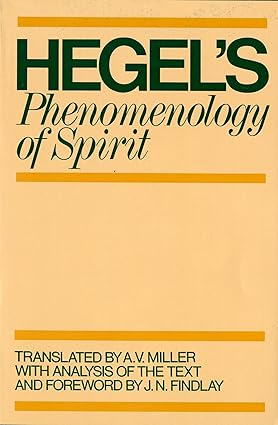](https://a.co/d/c1lqFtF)

<figcaption align="center"> <i>Phänomenologie des Geistes</i> Oxford edition.</figcaption>

</div><div>

## Hegels Phänomenologie

Das Buch trug ursprünglich den Titel "**Phänomenologie des Geistes**" von seinem Autor: G.W.F. Hegel.

- Das `1807` veröffentlichte Werk markiert eine bedeutende Entwicklung des deutschen Idealismus nach Kant.
- In diesem Buch entwickelt Hegel seine Konzepte der Dialektik.

> Price at Amazon used to be $ 17.83.

</div>
</div>

---

# Image and text on the same slide (2)

<div class="multicolumn vcenter"><div>

## Kant, Leibniz & Newton

Philosophy and the sciences were closely linked in the age of Leibniz, Newton, and Kant.

This addresses the transformations of metaphysics as a discipline, the emergence of analytical mechanics, the diverging avenues of 18th-century Newtonianism, the body-mind problem, and philosophical principles of classification in the life sciences.

> Price at Amazon used to be 128,39 €

</div><div>

[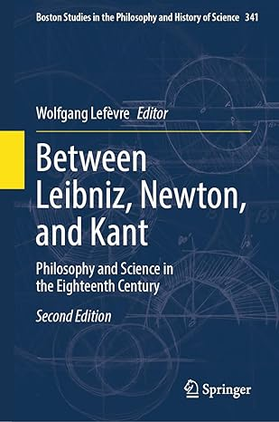](https://amzn.eu/d/9zaa7UK)

<figcaption align="center">Springer edition (2023).</figcaption>

</div></div>

---

<!-- _class: white-slide -->

# Multi-images Environment (1)

<div class="multicolumn vcenter" align="center">

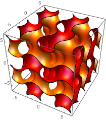
<br><span class="figcaption">Math001.</span>

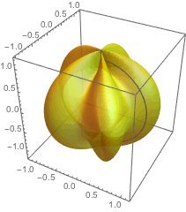
<br><span class="figcaption">Math002.</span>

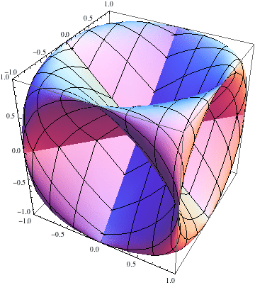
<br><span class="figcaption">Math003.</span>

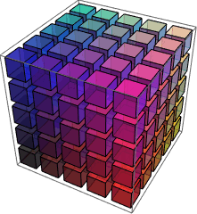
<br><span class="figcaption">Math004.</span>

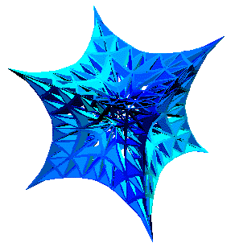
<br><span class="figcaption">Math005.</span>

</div>

---

<!-- _class: white-slide -->

# Multi-images Environment (2)

<div class="multicolumn vcenter" align="center">

<div>


<br><span class="figcaption">Math001.</span>


<br><span class="figcaption">Math002.</span>

</div>


<br><span class="figcaption">Math003.</span>

<div>


<br><span class="figcaption">Math004.</span>


<br><span class="figcaption">Math005.</span>

</div></div>

---

<!-- _class: white-slide -->

# Figures and caption in _multicolumn_

<div class="multicolumn" align="center">

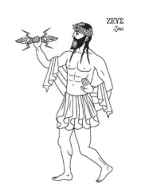
<br><span class="figcaption">God Zeus</span>

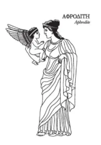
<br><span class="figcaption">Afrodite</span>


<br><span class="figcaption">Dionísio</span>

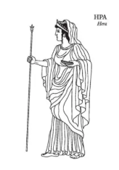
<br><span class="figcaption">Era</span>

</div>

---

<!-- _class: chapter -->

# Animations

## Usually works in html only...

---

<!-- _class: black-slide -->

# Animations &nbsp;<span style="font-size:0.5em; color:yellow;">(works in HTML only)</span>

<div class=multicolumn vcenter><div align=center>


<figcaption> First animation.

</div><div align=center>

<iframe src="https://assets.pinterest.com/ext/embed.html?id=77335318596012123" height="390" width="400" frameborder="0" scrolling="no" ></iframe>
<p>
<figcaption> Second animation.

</div></div>

---

<!-- _class: white-slide -->
<!-- _footer: Vídeo de Nikolay Sobolev no Pexels: https://www.pexels.com/pt-br/video/ar-aviao-aeronave-aeroporto-16127349/ -->

# Video

<center>

<video controls height="400px">
  <source src="https://cunhapaulo.github.io/marpx/videos/sample01.mp4">
</video>

<figcaption>Video playing in Marp available only in html export.

</center>

---

<!-- _class: chapter -->

# Lists

## Ordered and unordered

---

# _Ordered_ and _unordered_ lists

<div class="multicolumn"><div>

1. First object in list;
2. Second object in list;
3. Third object in list;
   1. First objetc in sublist;
   2. Second object in sublist;
      1. Another level;
      2. Yet another item.
   3. Third object in sublist.
4. Fourth object in List.

</div><div>

- First object in list;
- Second object in list;
- Third object in list;
  - First objetc in sublist;
  - Second object in sublist;
    - Another level;
    - Yet another item.
  - Third object in sublist;
- Fourth object in List;

</div></div>

---

<!-- _class: chapter -->

# Tables

## Organizing data with tables in Markdown

---

# Renaissance painters

<center>

| Painter           | Country | Birth Year | Death Year | Most Famous Work           |
| ----------------- | :-----: | :--------: | :--------: | -------------------------- |
| Albrecht Dürer    | Germany |    1471    |    1528    | _Melencolia I_             |
| Leonardo da Vinci |  Italy  |    1452    |    1519    | _Mona Lisa_                |
| Michelangelo      |  Italy  |    1475    |    1564    | _Sistine Chapel Ceiling_   |
| Raphael           |  Italy  |    1483    |    1520    | _The School of Athens_     |
| Titian            |  Italy  |   ~1488    |    1576    | _Assumption of the Virgin_ |

<tabcaption>Renowned Renaissance painters with biographical data and masterpieces (alphabetical order).</tabcaption>

<center>

---

# Programming languages

<center>

| Language | Creator(s)          | Year | Main Paradigm(s)                            |
| -------- | ------------------- | ---- | ------------------------------------------- |
| C        | _Dennis Ritchie_    | 1972 | Structured, Procedural                      |
| C++      | _Bjarne Stroustrup_ | 1983 | Object-oriented, multi-paradigm             |
| Erlang   | _Joe Armstrong_     | 1986 | Funcional, Concorrente                      |
| Haskell  | _Comitê Haskell_    | 1990 | Purely Functional                           |
| Java     | _James Gosling_     | 1995 | Object-Oriented                             |
| Pascal   | _Niklaus Wirth_     | 1970 | Structured, Procedural                      |
| Python   | _Guido van Rossum_  | 1991 | Multi-paradigm (OO, Procedural, Functional) |

<tabcaption>List of programming languages.</tabcaption>

</center>

---

<!-- _class: chapter -->

# Mathematical Formulations

## Writing equations with LaTeX

---

<!-- _class: white-slide -->

# Probability Distribution (1)

<div class="multicolumn vcenter"><div>

$$
f(x) = \frac{1}{\sigma \sqrt{2\pi}} \exp\left( -\frac{(x - \mu)^2}{2\sigma^2} \right)
$$

<figcaption>Normal Distribution (Gaussian).</figcaption>

</div><div>


<figcaption>Multivariate Normal Distribution.</figcaption>

</div></div>

---

<!-- _class: white-slide -->

# Probability Distribution (2)

<div class="multicolumn vcenter"><div>

$$
f(x) = \frac{\sqrt{\frac{(d_1 x)^{d_1} d_2^{d_2}}{(d_1 x + d_2)^{d_1 + d_2}}}}{x \, B\left(\frac{d_1}{2}, \frac{d_2}{2}\right)}
$$

<figcaption>Fisher-Snedecor F distribution.</figcaption>

</div><div>


<figcaption>Multivariate Normal Distribution.</figcaption>

</div></div>

---

# Electromagnetic Field (Differential form)

Below, in modern vector notation, in _differential form_, are Maxwell's four equations governing the `electromagnetic field`.

$$
\begin{align}
\nabla \cdot \mathbf{E} &= \frac{\rho}{\varepsilon_0}
        &&\text{(Gauss's law)}\\
\nabla \cdot \mathbf{B} &= 0
        &&\text{(No magnetic monopoles)}\\
\nabla \times \mathbf{E} &= -\,\frac{\partial \mathbf{B}}{\partial t}
        &&\text{(Faraday-Lenz law)}\\
\nabla \times \mathbf{B} &= \mu_0 \mathbf{J}
        + \mu_0 \varepsilon_0\,\frac{\partial \mathbf{E}}{\partial t}
        &&\text{(Ampere-Maxwell Law)}
\end{align}
$$

---

# Electromagnetic Field (Integral form)

Below, in modern vector notation, in _integral form_, are Maxwell's four equations governing the electromagnetic field.

$$
\begin{align}
\oint_{\Sigma} \mathbf{E}\cdot d\mathbf{S}
      &= \frac{Q_{\text{enc}}}{\varepsilon_0}
        &\text{(Gauss's law)}\\
\oint_{\Sigma} \mathbf{B}\cdot d\mathbf{S}
      &= 0
        &\text{(No magnetic monopoles)}\\
\oint_{\partial\Sigma} \mathbf{E}\cdot d\mathbf{l}
      &= -\,\frac{d}{dt}\int_{\Sigma}\mathbf{B}\cdot d\mathbf{S}
        &\text{(Faraday-Lenz law)}\\
\oint_{\partial\Sigma} \mathbf{B}\cdot d\mathbf{l}
      &= \mu_0 I_{\text{enc}}
      + \mu_0 \varepsilon_0\,\frac{d}{dt}
        \int_{\Sigma}\mathbf{E}\cdot d\mathbf{S}
        &\text{(Ampere-Maxwell Law)}
\end{align}
$$

---

<!-- _class: chapter -->

# Code

## Computer programs source code

---

<!-- _class: white-slide -->

# Python programs

<div class="multicolumn"><div>

```python
"""
O programa traça, em 2D, os perfis instantâneos do
campo elétrico E (y) e do campo magnético B (z),
ambos perpendiculares ao eixo de propagação x.
"""
import numpy as np
import matplotlib.pyplot as plt

# Constantes e parâmetros
c = 3e8
E0 = 1.0
lambda_ = 1.0
k = 2 * np.pi / lambda_
omega = 2 * np.pi * c / lambda_
x = np.linspace(0, 2 * lambda_, 1000)
t = 0
E = E0 * np.sin(k * x - omega * t)
B = (E0 / c) * np.sin(k * x - omega * t)
B_scaled = c * B  # para visualização

plt.plot(x, E, label='E(x, t=0)')
plt.plot(x, B_scaled, label='c·B(x, t=0)')
plt.xlabel('x (m)')
plt.ylabel('Amplitude (u.a.)')
plt.title('Propagação de onda eletromagnética no vácuo (instantâneo)')
plt.legend()
plt.grid(True)
plt.show()
```

<figcaption> First program.</figcaption>

</div><div>

```python
import numpy as np
import matplotlib.pyplot as plt
from mpl_toolkits.mplot3d import Axes3D   # registra o proj. 3-D

# --------------------- parâmetros físicos ----------------------
c   = 3.0e8                      # velocidade da luz (m s⁻¹)
E0  = 1.0                        # amplitude arbitrária do campo elétrico (V m⁻¹)
lam = 1.0                        # comprimento de onda (m)
k = 2*np.pi/lam                  # número de onda
ω = 2*np.pi*c/lam                # frequência angular
# domínios espacial e temporal
x = np.linspace(0, 2*lam, 1000)  # duas ondas completas
t = 0.0                          # instante “congelado”
# --------------------- campos E e B ----------------------------
E =  E0 * np.sin(k*x - ω*t)      # componente em y
B = (E0/c) * np.sin(k*x - ω*t)   # componente em z (antes do escalonamento)
B_plot = c * B                   # escala-se por c para comparar a E
# --------------------- figura 3-D ------------------------------
fig = plt.figure(figsize=(8, 4))
ax  = fig.add_subplot(111, projection='3d')

# linha do campo elétrico: (x, E, 0)
ax.plot(x, E, np.zeros_like(x), label='E(x, t=0)')
# linha do campo magnético escalonado: (x, 0, c B)
ax.plot(x, np.zeros_like(x), B_plot, label='c·B(x, t=0)')
# rótulos e estética
ax.set_xlabel('x (m)')
ax.set_ylabel('E (V/m)')
ax.set_zlabel('c·B (V/m)')
ax.set_title('Propagação de uma onda eletromagnética no vácuo (instantâneo 3-D)')
ax.legend()
plt.tight_layout()
plt.show()
```

<figcaption> Second program.</figcaption>

</div></div>

---

<!-- _class: white-slide -->

# Electromagnetic wave propagation (1)

[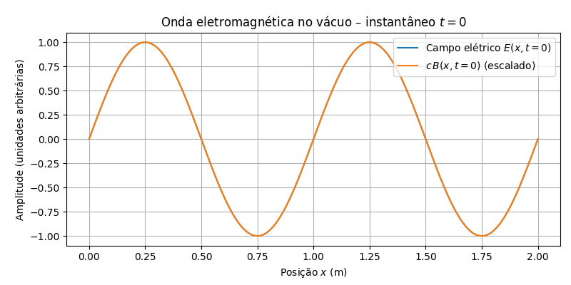](./assets/programs/eletromag-plot01.py)

<figcaption>Result of the 3D rendering of the program electromag-plot01.py.</figcaption>

---

<!-- _class: white-slide -->

# Electromagnetic wave propagation (2)

[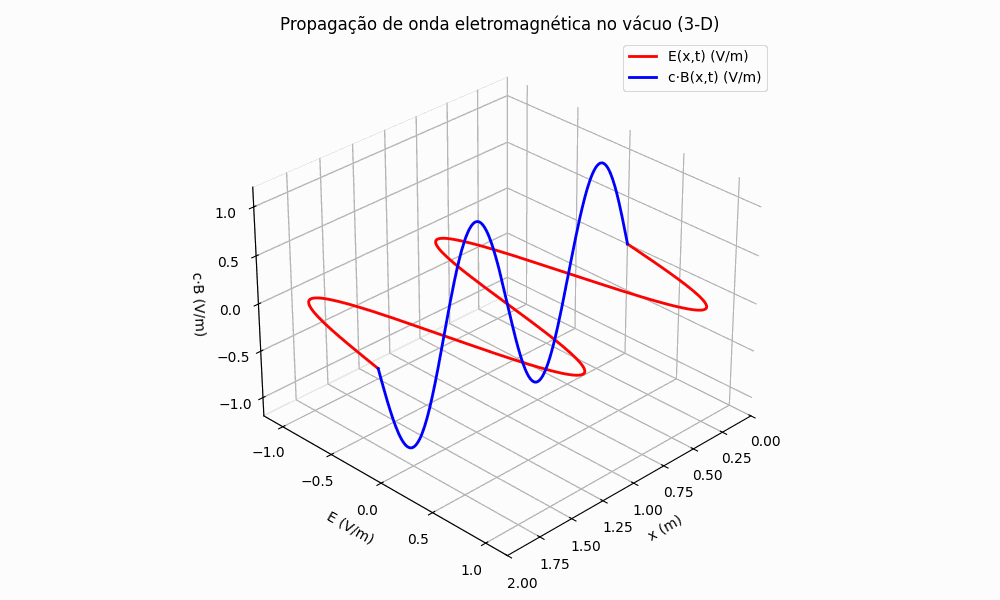](./assets/programs/eletromag-plot04-animate.py)

<figcaption>3D animation of an electromagnetic wave propagation.</figcaption>

---

<!-- _class: chapter -->

# Quotes

## Special text deserves special space

---

<!-- _class: quote -->

"There is an **increasing** demand of current information systems to incorporate the use of a higher degree of formalism in the development process. **Formal Methods** consist of a set of tools and techniques based on mathematical model and formal logic that are used to **specify and verify** requirements and designs for hardware and software systems."

---

<!-- _class: quote dark -->

"There is an **increasing** demand of current information systems to incorporate the use of a higher degree of formalism in the development process. **Formal Methods** consist of a set of tools and techniques based on mathematical model and formal logic that are used to **specify and verify** requirements and designs for hardware and software systems."

---

<!-- _class: chapter -->

# Callouts

---

<!-- _class: white-slide -->

# Callouts

<div class="multicolumn">

  <div class="callout info">

# Info

Text for information with <br> **Markdown** formatting.

  </div>

```md
<div class="callout">

# Info

Text for information with <br> **Markdown** formatting.

</div>
```

  </div>

<div class="multicolumn">

  <div class="callout danger">

# Danger

Another text with <br> **Markdown** formatting.

  </div>

```md
<div class="callout danger">

# Danger

Another text with <br> **Markdown** formatting.

</div>
```

</div>

---

<!-- _class: white-slide -->

# Callouts types

<div class="multicolumn">

  <div class="callout success">

# Success

You may use in semantics.

  </div>

  <div class="callout abstract">

# Abstract

You may use in semantics.

  </div>

  <div class="callout tip">

# Tip

You may use in semantics.

  </div>
  
  <div class="callout todo">

# ToDo

You may use in semantics.

  </div>

</div>

<div class="multicolumn">

  <div class="callout note">

# Note

You may use in semantics.

  </div>

  <div class="callout example">

# Example

You may use in semantics.

  </div>
  
  <div class="callout quote">

# Quote

You may use in semantics.

  </div>

  <div class="callout question">

# Question

You may use in semantics.

  </div>

</div>

<div class="multicolumn">

  <div class="callout warning">

# Warning

You may use in semantics.

  </div>

  <div class="callout failure">

# Failure

You may use in semantics.

  </div>

  <div class="callout danger">

# Danger

You may use in semantics.

  </div>

  <div class="callout bug">

# Bug

You may use in semantics.

  </div>

</div>

---

<!-- class: "chapter" -->

# Appendix

## Bibliography, References, Appendix. etc.

---

<!-- class: references -->

# Appendix 1 - Special Sections (1)

<center>

| CSS Section         | Description/Purpose         | Markdown Class (example)       |
| ------------------- | --------------------------- | :----------------------------- |
| section.title       | Title slide                 | `<!-- _class: title -->`       |
| section.title-bg    | Title slide with background | `<!-- _class: title-bg -->`    |
| section.chapter     | Chapter slide               | `<!-- _class: chapter -->`     |
| section.chapter-alt | Alternative chapter         | `<!-- _class: chapter-alt -->` |
| section.agenda      | Agenda/content slide        | `<!-- _class: agenda -->`      |
| section.end         | Thank you slide             | `<!-- _class: end -->`         |
| section.end-bg      | Thank you with background   | `<!-- _class: end-bg -->`      |
| section.copyright   | Copyright slide             | `<!-- _class: copyright -->`   |
| section.logos       | Slide with additional logos | `<!-- _class: logos -->`       |

<tabcaption>List of tags used (1).</tabcaption>

</center>

---

# Appendix 1 - Special Sections (2)

<center>

| CSS Section                 | Description/Purpose                     | Markdown Class (example)               |
| --------------------------- | --------------------------------------- | -------------------------------------- |
| section.blank               | Blank slide                             | `<!-- _class: blank -->`               |
| section.nobrand             | Slide without branding                  | `<!-- _class: nobrand -->`             |
| section.multicolumn         | Slide with multiple columns             | `<!-- _class: multicolumn -->`         |
| section.multicolumn vcenter | Vertically centered IN multiple columns | `<!-- _class: multicolumn vcenter -->` |
| section.grid-tlr            | Grid: top, left, right                  | `<!-- _class: grid-tlr -->`            |
| section.grid-lrb            | Grid: left, right, bottom               | `<!-- _class: grid-lrb -->`            |
| section.quote               | Quote slide (unified quote)             | `<!-- _class: quote -->`               |
| section.quote.dark          | Alternative quote (formerly quote2)     | `<!-- _class: quote dark -->`          |
| section.references          | References/bibliography slide           | `<!-- _class: references -->`          |

<tabcaption>List of tags used (2).</tabcaption>

</center>

---

<!-- _class: "references" -->

# References

<div class="multicolumn"><div>

1. AMERIKS, Karl; HÖFFE, Otfried. **Kant’s Moral and Legal Philosophy**. tradução: Nicholas Walker. Cambridge, Massachusetts: Cambridge University Press, 2009-. ISSN 1878-6847.(The German Philosophical Tradition).
2. ARISTOTELES. **Nikomachische Ethik**. Berlin: Akademie Verlag, 2010. (Klassiker Auslegen).v. 2
3. CASSIRER, Ernst. **The Myth of the State**. New Haven, USA: Yale University Press, 1946.
4. EPSTEIN, Richard L.; CARNIELLI, Walter A. **Computability: Computable Functions, Logic, and the Foundations of Mathematics**. 3. ed. Socorro, New Mexico, USA: Advanced Reasoning Forum, 2008.
5. GADAMER, Hans-Georg. **Wahrheit und Methode**. Berlin: Akademie Verlag, 2007. v. 30.
6. HEGEL, Georg Friederich Wilhelm. **Hegel´s Phenomenology of Spirit**. Tradução: A. V. Miller. New York: Oxford University Press, 2004.

</div><div>

7. HEIDEGGER, Martin. **Sein und Zeit**. 11. ed. Tübingen: Max Niemeyer Verlag, 1967.
8. HUSSERL, Edmund. **The Crisis of European Sciences and Transcendental Phenomenology**. Evanston, USA: Northwestern University Press, 1970.
9. KANT, Immanuel. **Kritik der Praktischen Vernunft**. Berlin: Akademie Verlag, 2002. (Klassiker Auslegen).v. 26
10. KANT, Immanuel. **Groundwork of the Metaphysics of Morals: A German-English Edition**. tradução: Mary Gregor; Jens Timmermann. Cambridge, UK: Cambridge University Press, 2011.
11. KARDEC, Allan. **Das Buch der Geister**. Übersetzung: Edith Burkhard. 3. ed. Brasília, DF: Internationaler Spiritistischer Rat, 2011.
12. PLATO. **Plato Republic**. Tradução: C. D. C. Reeve. Indianapolis, IN, USA: Hackett Publishing Company, 2004.

</div></div>

---

<!-- _class: references  -->

# Credits

<div class="multicolumn"><div>

1. Special thanks to: [`Yuki Hattori` (GitHub)](https://github.com/yhatt) creator of [Marp](https://github.com/Marp-team/Marp).
2. Early inspiring ideas: [`Juan Vera del Campo` CSS styles](https://github.com/Juanvvc). Gracias!
3. Inspired by the work of [`Daniel Kriesten`](https://git.hs-mittweida.de/kriesten) at [marp-template-hsmw](https://git.hs-mittweida.de/marp/marp-template-hsmw). Herzlichen Dank!
4. Biography on Wikipedia: [`Jacques-Louis David`](https://de.wikipedia.org/wiki/Jacques-Louis_David).
5. Cover image: [`Flute Player` Courtesy of ©️ nicoolay/DigitalVision Vectors/Getty Images](https://a.co/d/hU2R2TM).
6. Cover image: Courtesy of ©️ Ishtar Bäcklund Dakhil [`Der Sohn des Odysseus` - Berlin: Verlag Urachhaus 2021.](https://amzn.eu/d/0U57lKN).

</div><div>

7. Figure of: [`Shaun The Sheep` - Aardman animations ltd. ©️ 2025](https://www.shaunthesheep.com/about/)
8. Video of: [`Nikolay Sobolev` no Pexels](https://www.pexels.com/pt-br/video/ar-aviao-aeronave-aeroporto-16127349/).
9. Foto de Wikipedia: [`La mort de Socrate`](https://pt.wikipedia.org/wiki/Ficheiro:David_-_The_Death_of_Socrates.jpg)
10. Foto de Wikipedia: [`Léonidas aux Thermopyles`](https://pt.m.wikipedia.org/wiki/Ficheiro:Jacques-Louis_David_004.jpg).
11. Foto de Wikipedia: [`Sócates`](https://upload.wikimedia.org/wikipedia/commons/thumb/a/a4/Socrates_Louvre.jpg/450px-Socrates_Louvre.jpg)
12. Foto de: [`Pixabay` no Pexels](https://www.pexels.com/pt-br/foto/fotografia-de-baixo-angulo-do-partenon-durante-o-dia-164336/).
13. Font `Fira Sans` imported from: [Google Fonts](https://fonts.google.com/).

</div></div>

---

<!-- _class: white-slide -->
<!-- _footer: "Shaun The Sheep ©️ 2025 aardman animations ltd." -->

<div class="vcenter">


</div>

---

[]()

<style scoped>
h2>a{
  color: red;
}
</style>

<!-- _class: blank -->

<div align="center">

# <!-- fit --> [Click to the ](#1)

## <!-- fit --> [Beginning](#1)

</div>
